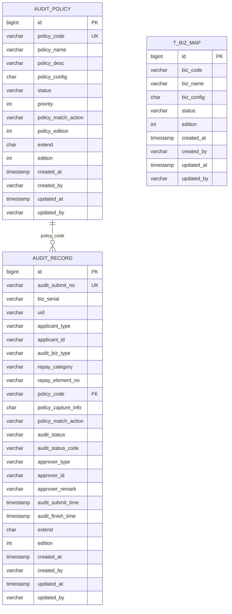

# 还款前置校验系统 - 数据库结构

## 概述

还款前置校验系统的数据库使用 MySQL/TiDB，数据库名称为 `repayfront`。

## 数据表列表

### 1. audit_policy（审计策略表）

**表说明：** 存储审计策略配置信息

**字段列表：**

| 字段名 | 类型 | 说明 | 备注 |
|--------|------|------|------|
| id | BIGINT | 主键 | 自增 |
| policy_code | VARCHAR | 策略编码 | 唯一标识 |
| policy_name | VARCHAR | 策略名称 |  |
| policy_desc | VARCHAR | 策略描述 |  |
| policy_config | CHAR | 策略配置 | JSON 格式 |
| status | VARCHAR | 状态 | ENABLE/DISABLE |
| priority | INTEGER | 优先级 | 数字越大优先级越高 |
| policy_match_action | VARCHAR | 策略匹配动作 |  |
| policy_edition | INTEGER | 策略版本 |  |
| extend | CHAR | 扩展字段 | JSON 格式 |
| edition | INTEGER | 版本号 | 乐观锁版本控制 |
| created_at | TIMESTAMP | 创建时间 |  |
| created_by | VARCHAR | 创建人 |  |
| updated_at | TIMESTAMP | 更新时间 |  |
| updated_by | VARCHAR | 更新人 |  |

**索引：**
- PRIMARY KEY (id)
- UNIQUE KEY (policy_code)

**业务说明：**
- 用于配置不同的审计策略
- 通过 priority 控制策略执行顺序
- status 控制策略是否启用

---

### 2. audit_record（审计记录表）

**表说明：** 存储审计执行记录

**字段列表：**

| 字段名 | 类型 | 说明 | 备注 |
|--------|------|------|------|
| id | BIGINT | 主键 | 自增 |
| audit_submit_no | VARCHAR | 审计提交单号 | 唯一标识 |
| biz_serial | VARCHAR | 业务流水号 | 关联业务系统 |
| uid | VARCHAR | 用户 ID |  |
| applicant_type | VARCHAR | 申请人类型 |  |
| applicant_id | VARCHAR | 申请人 ID |  |
| audit_biz_type | VARCHAR | 审计业务类型 |  |
| repay_category | VARCHAR | 还款分类 |  |
| repay_element_no | VARCHAR | 还款要素编号 |  |
| policy_code | VARCHAR | 策略编码 | 关联 audit_policy |
| policy_capture_info | CHAR | 策略捕获信息 | JSON 格式 |
| policy_match_action | VARCHAR | 策略匹配动作 |  |
| audit_status | VARCHAR | 审计状态 | PENDING/APPROVED/REJECTED |
| audit_status_code | VARCHAR | 审计状态码 |  |
| approver_type | VARCHAR | 审批人类型 |  |
| approver_id | VARCHAR | 审批人 ID |  |
| approver_remark | VARCHAR | 审批备注 |  |
| audit_submit_time | TIMESTAMP | 审计提交时间 |  |
| audit_finish_time | TIMESTAMP | 审计完成时间 |  |
| extend | CHAR | 扩展字段 | JSON 格式 |
| edition | INTEGER | 版本号 | 乐观锁版本控制 |
| created_at | TIMESTAMP | 创建时间 |  |
| created_by | VARCHAR | 创建人 |  |
| updated_at | TIMESTAMP | 更新时间 |  |
| updated_by | VARCHAR | 更新人 |  |

**索引：**
- PRIMARY KEY (id)
- UNIQUE KEY (audit_submit_no)
- INDEX (biz_serial)
- INDEX (uid)
- INDEX (policy_code)
- INDEX (audit_status)

**业务说明：**
- 记录每次审计的执行情况
- 关联业务流水号和用户信息
- 记录审计状态和审批信息

---

### 3. t_biz_map（业务映射表）

**表说明：** 存储业务流程映射信息

**字段列表：**
（待补充）

---

## ER 图



## 数据库配置

### 连接配置

```properties
# JDBC URL
caijiajia.db.database.dataSource.url=jdbc:mysql://${mysql.address.repayfront}/repayfront?useUnicode=true&characterEncoding=utf8&useSSL=false&allowMultiQueries=true

# MyBatis Mapper 扫描包
caijiajia.db.database.mybatis.basePackage=cn.caijiajia.repayfront.mysql mapper,cn.caijiajia.tradecommon.tradeevent.mapper,cn.caijiajia.tradecommon.tradelog.mapper,cn.caijiajia.bizflow.process.mapper,cn.caijiajia.bizactionresult.jdbc.mapper

# 事务管理
caijiajia.db.database.transaction.beanName=transactionManager
caijiajia.db.database.dataSource.beanName=dataSource
caijiajia.db.database.transaction.enable=true
```

### 事务配置

- 事务管理器：`transactionManager`
- 数据源：`dataSource`
- 事务启用：`true`

## 数据访问层

### Mapper 接口

项目使用 MyBatis 作为持久层框架，主要的 Mapper 接口：

- `cn.caijiajia.repayfront.mysql.mapper.TAuditPolicyMapper` - 审计策略 Mapper
- `cn.caijiajia.repayfront.mysql.mapper.TAuditRecordMapper` - 审计记录 Mapper
- `cn.caijiajia.repayfront.mysql.mapper.TBizMapMapper` - 业务映射 Mapper

### Mapper XML 文件

Mapper XML 配置文件位于：
- `repayfront/src/main/resources/cn/caijiajia/repayfront/mysql/mapper/`

## 数据库安全

- 敏感字段使用加密存储
- SQL 注入防护（使用 MyBatis 参数化查询）
- 数据库访问权限控制
- 数据备份和恢复机制

## 数据库优化建议

- 为常用查询字段创建索引
- 定期清理历史审计记录
- 使用分表策略处理大数据量
- 监控慢查询并优化
- 使用读写分离减轻主库压力
