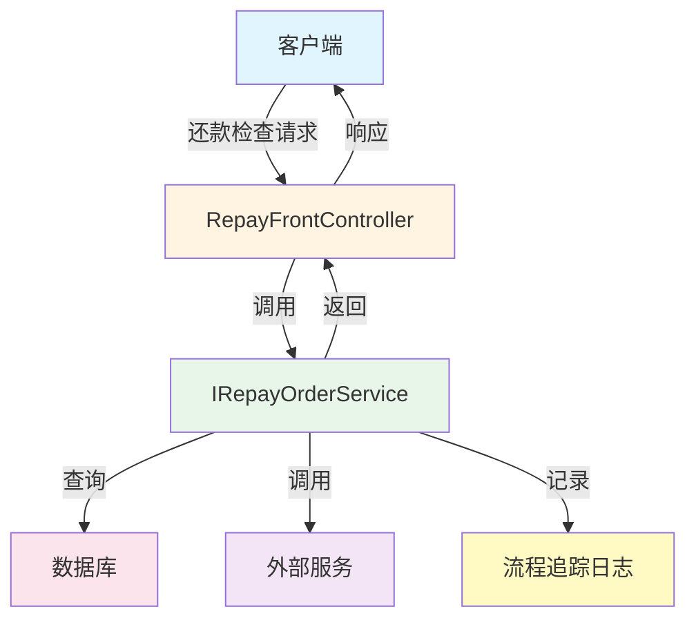
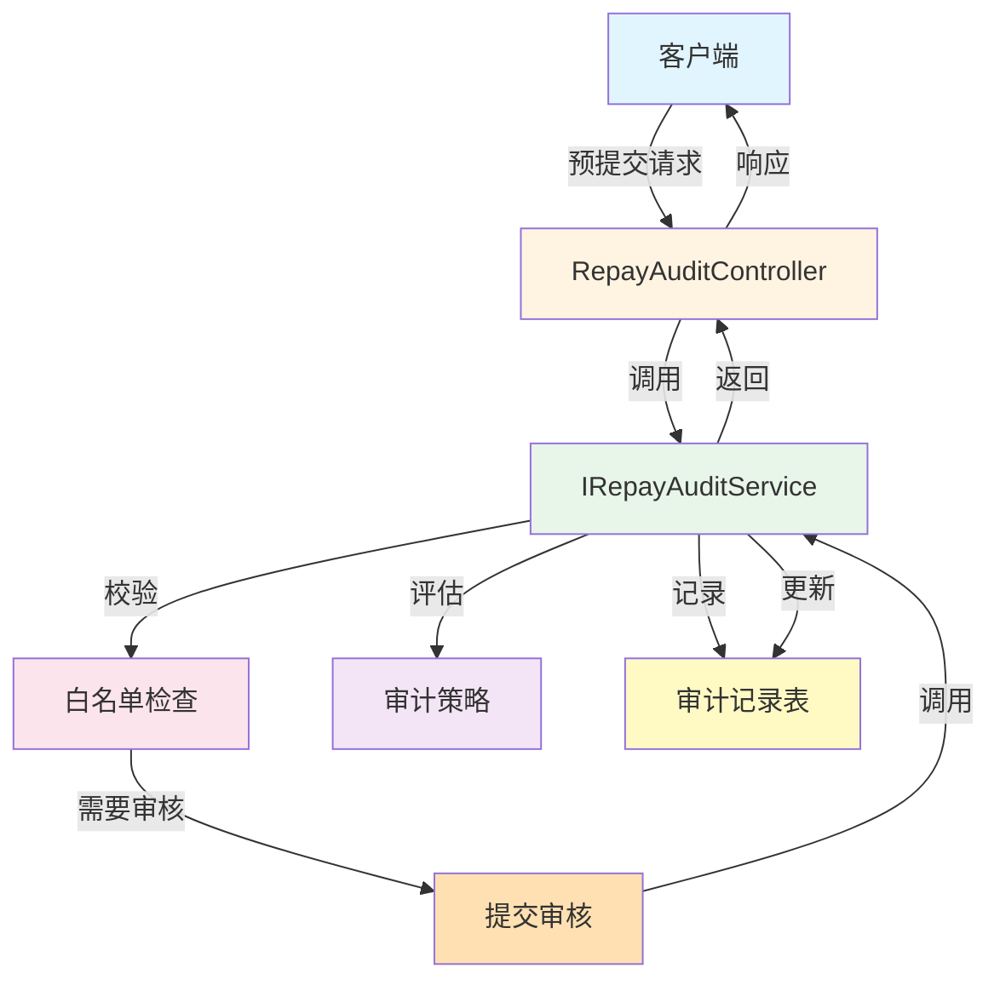

# 还款前置校验系统 - 接口流程索引

## 概述

本文档是还款前置校验系统所有接口的索引，包含每个接口的详细文档链接。

## 接口分类

### 1. 还款前置校验接口（RepayFrontController）

| 接口名称 | 接口路径 | 文档链接 |
|---------|---------|---------|
| 还款置灰 | POST /repayOrder/gray | [查看详情](./03-接口流程-还款置灰.md) |
| 按模式还款置灰 | POST /repayOrder/mode/gray | [查看详情](./03-接口流程-按模式还款置灰.md) |
| 还款检查配置信息 | POST /repayOrder/config | [查看详情](./03-接口流程-还款检查配置信息.md) |
| 还款检查 | POST /repaySubmit/check | [查看详情](./03-接口流程-还款检查.md) |
| 账期制还款检查 | POST /repaySubmit/bill/check | [查看详情](./03-接口流程-账期制还款检查.md) |
| 还款检查（线下还款与人工扣款） | POST /repaySubmit/check/v2 | [查看详情](./03-接口流程-还款检查V2.md) |
| 还款工具检查（已废弃） | POST /repayTool/check | [查看详情](./03-接口流程-还款工具检查.md) |
| 还款工具检查V2 | POST /repayTool/check/v2 | [查看详情](./03-接口流程-还款工具检查V2.md) |
| 还款规则配置信息 | POST /repayRule/config | [查看详情](./03-接口流程-还款规则配置信息.md) |
| 还款结清展示检查 | POST /settleShow/check | [查看详情](./03-接口流程-还款结清展示检查.md) |

### 2. 还款审核接口（RepayAuditController）

| 接口名称 | 接口路径 | 文档链接 |
|---------|---------|---------|
| 还款审核预提交 | POST /repayAudit/preSubmit | [查看详情](./03-接口流程-还款审核预提交.md) |
| 还款审核提交 | POST /repayAudit/submit | [查看详情](./03-接口流程-还款审核提交.md) |
| 还款审核结果查询 | POST /repayAudit/result | [查看详情](./03-接口流程-还款审核结果查询.md) |
| 审核白名单信息获取 | POST /repayAudit/whiteList/get | [查看详情](./03-接口流程-审核白名单信息获取.md) |
| 白名单信息变更 | POST /repayAudit/whiteList/update | [查看详情](./03-接口流程-白名单信息变更.md) |

### 3. 审核策略管理接口（RepayPolicyController）

| 接口名称 | 接口路径 | 文档链接 |
|---------|---------|---------|
| 主审核策略获取 | POST /mgr/auditPolicy/main/get | [查看详情](./03-接口流程-主审核策略获取.md) |
| 审核策略列表获取 | POST /mgr/auditPolicy/list/get | [查看详情](./03-接口流程-审核策略列表获取.md) |
| 审核策略详情定义获取 | POST /mgr/auditPolicy/definition/get | [查看详情](./03-接口流程-审核策略详情定义获取.md) |
| 审核策略变更提交 | POST /mgr/auditPolicy/post | [查看详情](./03-接口流程-审核策略变更提交.md) |

## 接口说明

### 适用场景

- **分期制、订单制**：还款置灰、还款检查、还款检查 V2、还款工具检查
- **账期制**：还款检查配置信息、账期制还款检查

### 接口流程

每个接口的详细流程包含：
- 接口名称和路径
- 请求参数（入参）
- 响应参数（出参）
- 调用方法（Service 层）
- 数据库交互
- 关键业务状态
- 业务流调用（如果有）
- Mermaid 流程图

## 接口调用示例

### 示例 1：还款检查流程

### 示例 2：还款审核流程

## 注意事项

1. 所有接口都使用 `POST` 方法
2. 请求和响应都使用 JSON 格式
3. 所有接口都需要进行参数校验（@Valid）
4. 接口调用了流程追踪日志，用于监控和问题排查
5. 敏感信息（如用户 ID）需要从 Header 或请求体中传递

## 接口版本

- 当前主要版本：V2.0
- 部分接口标记为 @Deprecated，建议使用新版本接口
- 接口版本升级会保持向后兼容性
