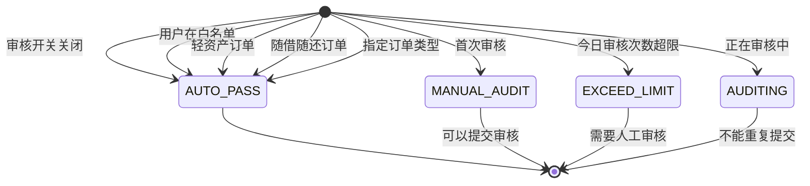
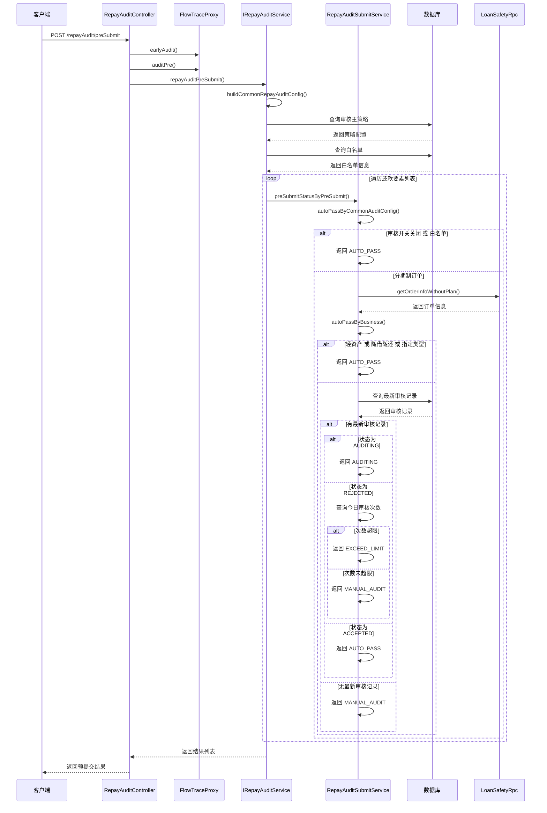
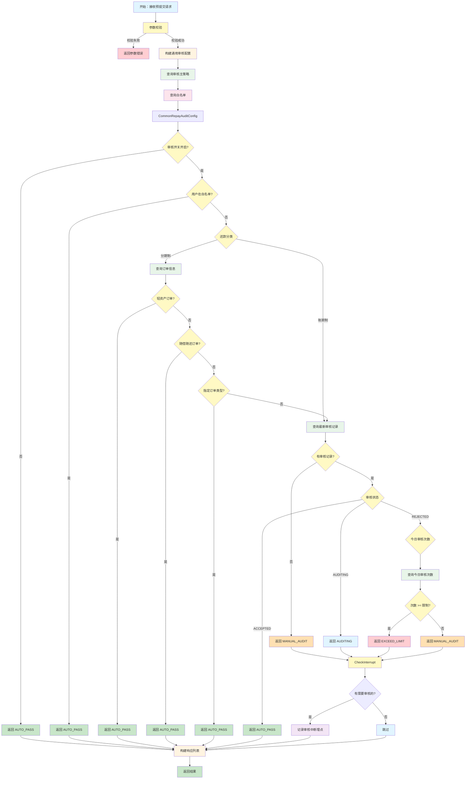
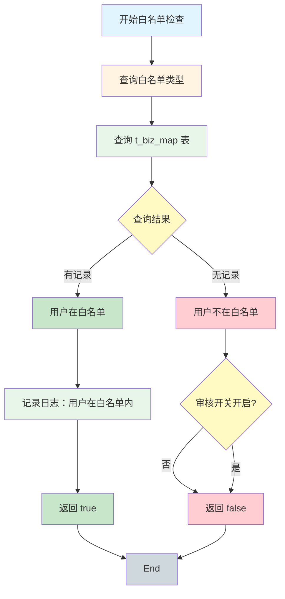
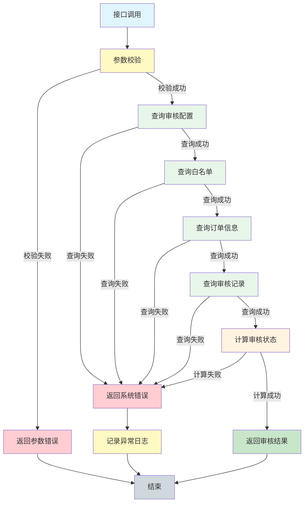

# 还款审核预提交接口流程

## 接口概述

**接口名称：** 还款审核预提交
**接口路径：** POST /repayAudit/preSubmit
**Controller：** RepayAuditController
**描述：** 在提交还款审核前，先进行预审核，判断是否需要人工审核

## 接口功能

对用户的还款请求进行预审核，根据审计策略、白名单、历史审核记录等因素，判断是否需要人工审核。如果需要审核，则进入审核流程；如果不需要审核，则直接通过。

## 请求参数（入参）

### RepayAuditPreSubmitReq

| 参数名 | 类型 | 必填 | 说明 | 取值范围/约束 | 示例 |
|--------|------|------|------|--------------|------|
| uid | String | 是 | 用户 ID | 非空字符串 | "user123456" |
| bizSerial | String | 是 | 业务流水号 | 非空字符串，用于关联业务流程和幂等控制 | "biz202603021200001" |

### RepayAuditPreSubmitReq.RepayElementPreSubmitReq

| 参数名 | 类型 | 必填 | 说明 | 取值范围/约束 | 示例 |
|--------|------|------|------|--------------|------|
| repayCategory | RepayCategory | 是 | 还款分类 | 枚举值：STAGE（分期制）、BILL（账期制） | STAGE |
| repayElementNo | String | 是 | 还款要素编号 | 非空字符串<br/>分期制：stageOrderNo（分期订单号）<br/>账期制：billCycleNo（账期号） | "stageOrder001" |

#### RepayCategory 枚举值

| 枚举值 | 说明 | 使用场景 |
|--------|------|---------|
| STAGE | 分期制还款 | 分期制订单、订单制还款 |
| BILL | 账期制还款 | 账期制还款 |

#### 请求示例

```json
{
  "uid": "user123456",
  "bizSerial": "biz202603021200001",
  "repayElementPreSubmitReqList": [
    {
      "repayCategory": "STAGE",
      "repayElementNo": "stageOrder001"
    },
    {
      "repayCategory": "STAGE",
      "repayElementNo": "stageOrder002"
    }
  ]
}
```

## 响应参数（出参）

### RepayAuditPreSubmitResp

| 参数名 | 类型 | 说明 | 备注 |
|--------|------|------|------|
| repayElementPreSubmitRespList | List&lt;RepayElementPreSubmitResp&gt; | 还款要素预提交结果列表 | 与请求列表一一对应 |

### RepayElementPreSubmitResp

| 参数名 | 类型 | 说明 | 备注 |
|--------|------|------|------|
| repayCategory | String | 还款分类 | STAGE 或 BILL |
| repayElementNo | String | 还款要素编号 | 与请求参数一致 |
| status | String | 状态枚举字符串 | 详见下表 |

#### PreSubmitStatus 状态枚举

| 状态码 | 状态说明 | 字符串值 | 处理方式 |
|--------|---------|---------|---------|
| AUTO_PASS | 自动通过 | "AUTO_PASS" | 无需审核，可以直接提交还款 |
| MANUAL_AUDIT | 需要人工审核 | "MANUAL_AUDIT" | 需要调用 `/repayAudit/submit` 接口提交审核 |
| EXCEED_LIMIT | 超出申请次数限制 | "EXCEED_LIMIT" | 今日审核次数超限，需要人工审核 |
| AUDITING | 正在审核中 | "AUDITING" | 该要素正在审核中，不能重复提交 |

#### 响应示例

```json
{
  "repayElementPreSubmitRespList": [
    {
      "repayCategory": "STAGE",
      "repayElementNo": "stageOrder001",
      "status": "AUTO_PASS"
    },
    {
      "repayCategory": "STAGE",
      "repayElementNo": "stageOrder002",
      "status": "MANUAL_AUDIT"
    }
  ]
}
```

## 调用方法（Service 层）

### 主要调用链

```java
RepayAuditController.repayAuditPreSubmit()
  → IRepayAuditService.repayAuditPreSubmit()
    → buildCommonRepayAuditConfig()           // 构建通用审核配置
      → bizMapRepositoryProxy.selectAuditPolicyMain()      // 查询审核主策略
      → bizMapRepository.selectOneByKeyAndValue()          // 查询白名单
    → RepayAuditSubmitService.preSubmitStatusByPreSubmit()  // 预提交状态判断
      → autoPassByCommonAuditConfig()        // 通用审核配置自动通过判断
      → autoPassByBusiness()                 // 业务规则自动通过判断
      → auditRecordRepositoryProxy.selectOneUpToDate()  // 查询最新审核记录
      → auditRecordRepositoryProxy.selectByRepayElementNoOneDay()  // 查询当日审核次数
```

### 核心服务

#### 1. IRepayAuditService（还款审核服务）

**职责：** 还款审核的主业务逻辑服务

**主要方法：**
- `repayAuditPreSubmit()` - 预提交审核
- `repayAuditSubmit()` - 提交审核
- `repayAuditResult()` - 查询审核结果
- `whiteListContainedByUid()` - 查询用户是否在白名单
- `whiteListUpdate()` - 更新白名单

#### 2. RepayAuditSubmitService（还款审核提交服务）

**职责：** 审核状态判断和审核提交逻辑

**主要方法：**
- `preSubmitStatusByPreSubmit()` - 预提交状态判断
- `repayAuditSubmit()` - 审核提交处理

**自动通过判断逻辑：**
```java
// 1. 审核开关未开启 → 自动通过
if (!config.getPolicyMain().getEnabled()) {
    return AUTO_PASS;
}

// 2. 用户在白名单 → 自动通过
if (config.isUidWhiteListContained()) {
    return AUTO_PASS;
}

// 3. 轻资产订单 → 自动通过
if (fundConfigGather.isSeamlessV2(assetBank)) {
    return AUTO_PASS;
}

// 4. 随借随还订单 → 自动通过
if (ProductEnum.ANY_REPAY.name().equals(product)) {
    return AUTO_PASS;
}

// 5. 指定订单类型 → 自动通过
if (configs.getAuditAutoPassBusinessType().contains(businessType)) {
    return AUTO_PASS;
}
```

#### 3. StageOrderInfoCollector（分期订单信息收集器）

**职责：** 收集和构建还款策略所需的用户信息

**主要方法：**
- `buildRepayPolicyUserInfoByUid()` - 根据用户 ID 构建策略用户信息
- `safetyQueryAndBuildUserInfoForRepayElementInfo()` - 安全查询并构建还款要素信息

#### 4. RepayAuditPolicyMatcher（还款审核策略匹配器）

**职责：** 匹配审计策略

**主要方法：**
- `match()` - 根据用户信息和策略列表进行匹配

### 依赖服务

- **BizMapRepositoryProxy** - 业务映射仓库代理
- **AuditRecordRepositoryProxy** - 审计记录仓库代理
- **IAuditPolicyRepository** - 审计策略仓库
- **IBizMapRepository** - 业务映射仓库
- **LoanSafetyRpc** - 贷款安全 RPC

## 数据库交互

### 查询操作

#### 1. 查询审核主策略配置

**表：** t_biz_map

**SQL 逻辑：**
```sql
SELECT * FROM t_biz_map
WHERE key_code = 'AUDIT_POLICY_MAIN'
```

**说明：** 查询审核开关、每日审核次数限制、自动通过等待时间等配置

#### 2. 查询白名单

**表：** t_biz_map

**SQL 逻辑：**
```sql
SELECT * FROM t_biz_map
WHERE key_code = 'UID_WHITE_LIST'
  AND value = #{uid}
```

**说明：** 查询用户是否在白名单中

#### 3. 查询最新审核记录

**表：** audit_record

**SQL 逻辑：**
```sql
SELECT * FROM audit_record
WHERE uid = #{uid}
  AND repay_element_no = #{repayElementNo}
ORDER BY created_at DESC
LIMIT 1
```

**说明：** 查询该用户该还款要素的最新一次审核记录

#### 4. 查询当日审核次数

**表：** audit_record

**SQL 逻辑：**
```sql
SELECT COUNT(*) FROM audit_record
WHERE uid = #{uid}
  AND repay_element_no = #{repayElementNo}
  AND DATE(audit_submit_time) = #{currentDate}
```

**说明：** 查询今日该用户该还款要素的审核提交次数

### 更新操作

预提交阶段不进行数据更新，只进行查询和评估。

### 事务处理

预提交接口不涉及数据库更新操作，因此不需要事务管理。

## 关键业务状态

### PreSubmitStatus 状态机



### 审核状态说明

| 状态 | 说明 | 判断条件 |
|------|------|---------|
| AUTO_PASS | 自动通过 | 审核开关关闭 或 用户在白名单 或 轻资产订单 或 随借随还订单 或 指定订单类型 |
| MANUAL_AUDIT | 需要人工审核 | 不满足自动通过条件 且 没有超限 且 不在审核中 |
| EXCEED_LIMIT | 超出限制 | 今日审核次数 ≥ 配置的审核次数限制 |
| AUDITING | 正在审核中 | 最新审核记录状态为 AUDITING |

### 审核次数限制

- 查询配置表获取每日审核次数限制（`auditSubmitTimes`）
- 统计当日该用户该还款要素的审核提交次数
- 如果次数达到或超过限制，返回 EXCEED_LIMIT 状态
- 次数限制只针对拒绝（REJECTED）后的重新申请

### 审核开关

- 查询审核主策略配置中的 `enabled` 字段
- 如果 `enabled = false`，所有还款请求自动通过审核
- 审核开关用于控制审核功能的启用和关闭

## 业务流调用

### 流程追踪

接口调用了流程追踪埋点日志：



### 流程追踪埋点

- **earlyAudit** - 提前审核埋点
- **auditPre** - 审核前埋点
- **earlyAuditInterrupt** - 提前审核中断埋点（当有任何要素需要审核时）

## Mermaid 流程图

### 主流程图



### 白名单检查子流程



## 业务规则详解

### 1. 审核开关规则

**配置位置：** t_biz_map 表，key_code = 'AUDIT_POLICY_MAIN'

**配置字段：**
- `enabled` - 审核开关，true 启用，false 关闭

**规则：**
- 如果审核开关关闭（enabled = false），所有还款请求自动通过
- 如果审核开关开启，继续进行后续判断

### 2. 白名单规则

**白名单类型：**
- UID_WHITE_LIST - 用户白名单

**规则：**
- 用户在白名单中，自动通过审核
- 白名单可以通过接口动态添加和删除
- 白名单用户优先级最高，即使审核开关关闭也会生效

### 3. 自动通过规则

**分期制订单自动通过条件：**

| 条件 | 说明 | 配置来源 |
|------|------|---------|
| 轻资产订单 | 无缝对接，无需审核 | IFundConfigGather.isSeamlessV2() |
| 随借随还订单 | ANY_REPAY 产品类型 | product = 'ANY_REPAY' |
| 指定订单类型 | 配置的业务类型自动通过 | configs.getAuditAutoPassBusinessType() |

**账期制订单：** 不支持分期制订单的自动通过规则

### 4. 审核次数限制规则

**配置位置：** t_biz_map 表，key_code = 'AUDIT_POLICY_MAIN'

**配置字段：**
- `auditSubmitTimes` - 每日审核次数限制

**规则：**
- 只统计审核拒绝（REJECTED）后的重新申请
- 审核通过（ACCEPTED）或审核中（AUDITING）不占用次数
- 统计维度：用户 + 还款要素编号 + 日期
- 达到或超过限制后，返回 EXCEED_LIMIT 状态

### 5. 审核状态转换规则

**状态说明：**
- **AUDITING（审核中）** - 审核已提交，等待审核人处理
- **ACCEPTED（审核通过）** - 审核人已通过
- **REJECTED（审核拒绝）** - 审核人已拒绝

**转换规则：**
- 最新审核状态为 AUDITING → 返回 AUDITING（不能重复提交）
- 最新审核状态为 ACCEPTED → 返回 AUTO_PASS（审核已通过，无需重复）
- 最新审核状态为 REJECTED → 检查今日审核次数

## 异常处理

### 参数校验异常

| 异常场景 | 错误码 | 错误信息 |
|---------|--------|---------|
| uid 为空 | PARAM_ERROR | "uid 不能为空" |
| bizSerial 为空 | PARAM_ERROR | "bizSerial 不能为空" |
| repayElementPreSubmitReqList 为空 | PARAM_ERROR | "repayElementPreSubmitReqList 不能为空" |
| repayCategory 为空 | PARAM_ERROR | "repayCategory 不能为空" |
| repayElementNo 为空 | PARAM_ERROR | "repayElementNo 不能为空" |
| repayCategory 枚举值无效 | PARAM_ERROR | "repayCategory 值不合法" |

### 业务异常

| 异常场景 | 错误码 | 处理方式 |
|---------|--------|---------|
| 查询订单信息失败 | ORDER_QUERY_ERROR | 返回系统错误，记录日志 |
| 查询审核记录失败 | AUDIT_RECORD_QUERY_ERROR | 返回系统错误，记录日志 |
| 数据库连接失败 | DB_ERROR | 返回系统错误，记录日志 |
| 外部服务调用失败 | EXTERNAL_ERROR | 返回系统错误，记录日志 |

### 异常流程



## 性能优化

### 1. 查询优化

- 审核主策略配置使用缓存
- 白名单查询使用缓存
- 审核记录查询添加索引

### 2. 批量处理

- 支持批量查询多个还款要素的审核状态
- 使用 Stream 并行处理

### 3. 缓存策略

**审核配置缓存：**
```java
@Cacheable(value = "audit:config", key = "'AUDIT_POLICY_MAIN'")
public AuditPolicyMain selectAuditPolicyMain() {
    // 查询逻辑
}
```

**白名单缓存：**
```java
@Cacheable(value = "audit:whitelist", key = "#uid")
public Optional<BizMapPo> selectOneByKeyAndValue(BizMapCode key, String value) {
    // 查询逻辑
}
```

## 注意事项

1. **幂等性**：同一业务流水号的重复请求应返回相同结果
2. **性能考虑**：审核配置和白名单应使用缓存，避免频繁查询数据库
3. **安全考虑**：不在日志中输出用户敏感信息
4. **数据一致性**：预提交不修改数据库，只是评估
5. **监控告警**：监控接口响应时间和失败率，设置告警阈值
6. **白名单管理**：白名单应定期清理，避免长期占用
7. **审核次数限制**：审核次数限制应合理设置，避免限制过严影响用户体验
8. **状态转换**：注意审核状态的转换条件，避免状态异常

## 相关接口

- [还款审核提交](./03-接口流程-还款审核提交.md) - 预审核后需要审核时调用
- [还款审核结果查询](./03-接口流程-还款审核结果查询.md) - 查询审核结果
- [审核白名单信息获取](./03-接口流程-审核白名单信息获取.md) - 获取白名单信息
- [白名单信息变更](./03-接口流程-白名单信息变更.md) - 变更白名单
