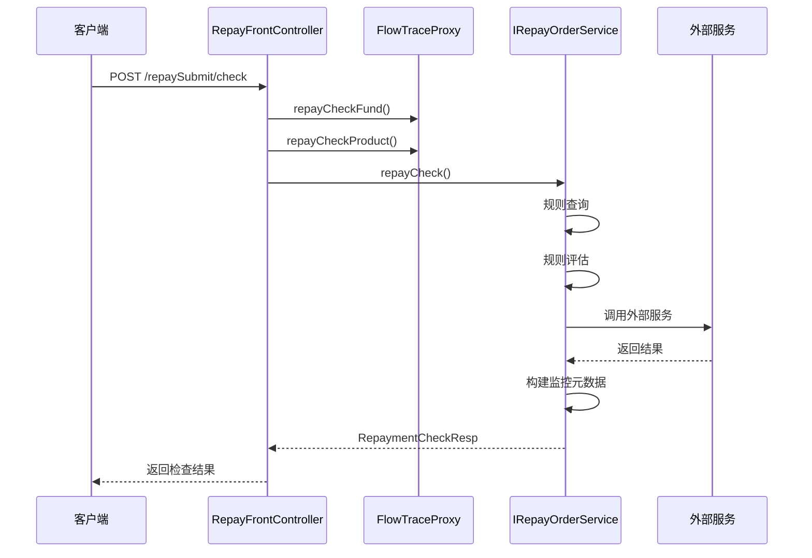
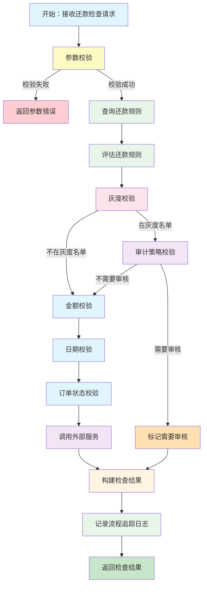
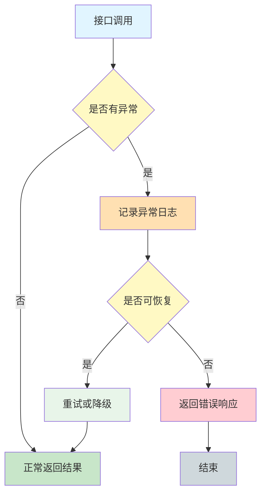

# 还款检查接口流程

## 接口概述

**接口名称：** 还款检查
**接口路径：** POST /repaySubmit/check
**适用场景：** 分期制、订单制（不适用账期制）
**Controller：** RepayFrontController

## 接口功能

在进行还款操作前，对用户的还款请求进行前置校验，确保还款请求的合规性和安全性。

## 请求参数（入参）

### RepaymentCheckReq

| 参数名 | 类型 | 必填 | 说明 |
|--------|------|------|------|
| uid | String | 是 | 用户 ID |
| bizSerial | String | 是 | 业务流水号 |
| sceneCode | String | 否 | 场景编码 |
| repayCategory | String | 是 | 还款分类 |
| repayElementList | List&lt;RepayElementInfo&gt; | 是 | 还款要素列表 |
| stageOrderInfoList | List&lt;StageOrderInfo&gt; | 是 | 分期订单信息列表 |

### RepayElementInfo

| 参数名 | 类型 | 必填 | 说明 |
|--------|------|------|------|
| repayElementNo | String | 是 | 还款要素编号 |
| repayAmount | BigDecimal | 是 | 还款金额 |
| repayDate | Date | 是 | 还款日期 |

## 响应参数（出参）

### RepaymentCheckResp

| 参数名 | 类型 | 说明 |
|--------|------|------|
| bizSerial | String | 业务流水号 |
| checkResult | Boolean | 检查结果（true：通过，false：不通过） |
| checkCode | String | 检查码 |
| checkMessage | String | 检查消息 |
| refusedRepayPlanVoList | List&lt;RefusedRepayPlanVo&gt; | 拒绝的还款计划列表 |

## 调用方法（Service 层）

### 主要调用链

```java
RepayFrontController.repayCheck()
  → IRepayOrderService.repayCheck()
    → IRepayRuleEvaluationService.evaluate()  // 规则评估
    → IRepayRuleQueryService.query()           // 规则查询
    → 外部服务调用（focusloancore、cardengine 等）
```

### 核心服务

- **IRepayOrderService** - 还款订单服务，主业务逻辑
- **IRepayRuleEvaluationService** - 还款规则评估服务
- **IRepayRuleQueryService** - 还款规则查询服务
- **IRepayBizFlowService** - 还款业务流程服务

## 数据库交互

### 查询操作

1. 查询还款规则配置
2. 查询用户还款信息
3. 查询分期订单信息
4. 查询审计策略（如需要）

### 更新操作

1. 记录还款检查日志（如果配置）
2. 更新流程追踪信息

## 关键业务状态

### 检查结果状态

| 状态码 | 状态说明 | 处理方式 |
|--------|---------|---------|
| SUCCESS | 检查通过 | 允许还款 |
| REFUSED | 检查拒绝 | 不允许还款，返回拒绝原因 |
| NEED_AUDIT | 需要审核 | 转入审核流程 |
| PENDING | 等待处理 | 暂存，等待后续处理 |

### 校验规则

1. **金额校验**：还款金额是否在允许范围内
2. **日期校验**：还款日期是否符合规则
3. **订单状态校验**：订单状态是否允许还款
4. **用户权限校验**：用户是否有还款权限
5. **灰度校验**：用户是否在灰度名单中
6. **审计策略校验**：是否触发审计策略

## 业务流调用

### 流程追踪

接口调用了流程追踪埋点日志：



### 流程追踪埋点

- `repayCheckFund` - 资金检查埋点
- `repayCheckProduct` - 产品检查埋点
- 业务数据（bizDataMap）：包含 sceneCode 场景编码

## Mermaid 流程图



## 异常处理

### 常见异常

| 异常类型 | 错误码 | 处理方式 |
|---------|--------|---------|
| 参数校验失败 | PARAM_ERROR | 返回参数错误信息 |
| 规则查询失败 | RULE_QUERY_ERROR | 返回系统错误 |
| 外部服务调用失败 | EXTERNAL_ERROR | 记录日志，返回友好提示 |
| 订单不存在 | ORDER_NOT_FOUND | 返回订单不存在错误 |

### 异常流程



## 注意事项

1. **幂等性**：同一业务流水号的重复请求应返回相同结果
2. **性能考虑**：规则查询结果应使用缓存，避免频繁查询数据库
3. **安全考虑**：不在日志中输出用户敏感信息
4. **数据一致性**：确保外部服务调用成功后再更新本地状态
5. **监控告警**：监控接口响应时间和失败率，设置告警阈值

## 相关接口

- [还款检查 V2](./03-接口流程-还款检查V2.md) - 线下还款与人工扣款使用
- [账期制还款检查](./03-接口流程-账期制还款检查.md) - 账期制场景
- [还款工具检查 V2](./03-接口流程-还款工具检查V2.md) - 还款工具使用
