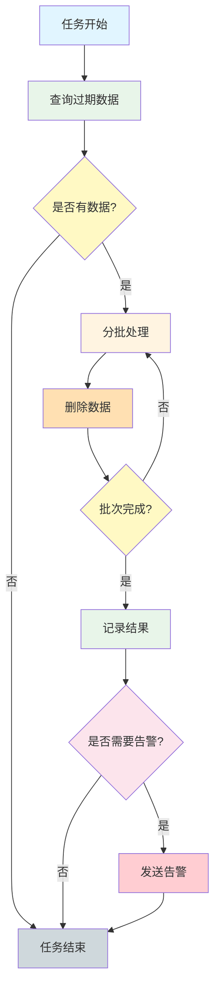

# 还款前置校验系统 - 调度任务

## 概述

还款前置校验系统目前未配置独立的定时调度任务。系统的业务处理主要通过 MQ 消息消费和 API 接口调用实现。

## 调度任务列表

### 当前状态

**系统暂无配置的定时调度任务。**

### 说明

经过代码扫描，项目中未发现使用以下注解的定时任务：
- `@Scheduled` - Spring 定时任务注解
- `@JobInfo` - 自定义任务信息注解

## MQ 消息消费

虽然没有定时任务，但系统通过 MQ 消息消费处理异步业务：

### Consumer 位置

```
repayfront/src/main/java/cn/caijiajia/repayfront/consumer/
```

### 消息消费者

MQ 消费者负责处理外部系统发送的还款相关消息，进行异步处理。

## 建议的调度任务

如果需要添加定时任务，可以考虑以下场景：

### 1. 数据清理任务

**功能：** 定期清理过期的审计记录和日志

**建议配置：**
- 执行频率：每天凌晨 2:00
- 保留时间：审计记录保留 180 天，日志保留 30 天

**SQL 示例：**
```sql
DELETE FROM audit_record
WHERE updated_at < DATE_SUB(NOW(), INTERVAL 180 DAY);
```

### 2. 统计任务

**功能：** 统计审计策略执行情况，生成报表

**建议配置：**
- 执行频率：每天凌晨 3:00
- 统计维度：策略匹配率、审核通过率、拒绝原因分布

### 3. 规则同步任务

**功能：** 从配置中心同步还款规则到本地缓存

**建议配置：**
- 执行频率：每小时执行一次
- 同步内容：还款规则配置、审计策略配置

### 4. 白名单清理任务

**功能：** 清理过期的白名单记录

**建议配置：**
- 执行频率：每天凌晨 4:00
- 清理条件：过期或长期未使用的白名单记录

## 如何添加调度任务

### 使用 Spring @Scheduled

```java
@Component
public class DataCleanupTask {

    @Scheduled(cron = "0 0 2 * * ?")
    public void cleanupExpiredRecords() {
        // 清理逻辑
    }
}
```

### 使用自定义任务框架

如果公司有统一的任务调度框架，可按规范接入。

## 任务监控

建议为调度任务添加以下监控：

### 监控指标

1. **任务执行状态**：成功/失败
2. **任务执行时间**：开始时间、结束时间、耗时
3. **处理数据量**：处理的记录数
4. **异常信息**：失败时的异常堆栈

### 告警配置

- 任务失败立即告警
- 任务执行超时告警（超过阈值时间）
- 数据处理量异常告警（过多或过少）

## 注意事项

1. **幂等性**：定时任务应支持重复执行，避免数据重复处理
2. **事务控制**：大批量数据处理应分批次提交，避免长事务
3. **日志记录**：详细记录任务执行日志，便于问题排查
4. **异常处理**：捕获并记录异常，避免任务中断
5. **性能优化**：合理设置批次大小，避免数据库压力过大

## Mermaid 流程图（建议的数据清理任务）



## 相关文档

- [项目工程结构](./01-项目工程结构.md) - 了解项目整体架构
- [数据库结构](./02-数据库结构.md) - 了解数据表结构
- [接口流程](./03-接口流程-索引.md) - 了解接口调用流程
