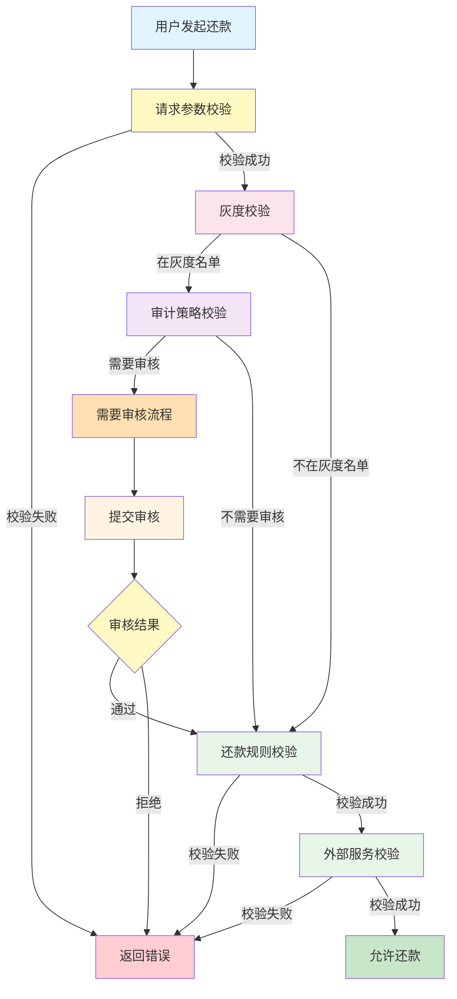
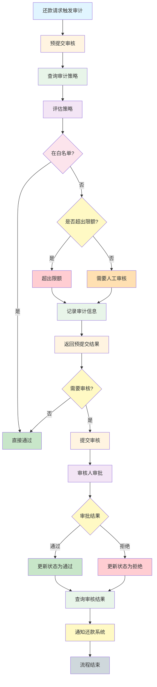
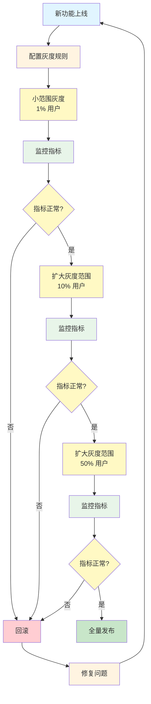

# 还款前置校验系统 - 业务流

## 概述

还款前置校验系统的业务流涵盖用户还款前的各种校验和审核流程，确保还款操作的安全性和合规性。

## 主要业务流程

### 1. 还款校验流程

#### 流程说明

用户发起还款请求后，系统进行一系列校验，包括灰度校验、规则评估、审计策略评估等。

#### 流程图

#### 关键节点说明

| 节点 | 说明 | 涉及接口 |
|------|------|---------|
| 请求参数校验 | 校验请求参数的完整性和合法性 | 所有接口 |
| 灰度校验 | 检查用户是否在灰度名单中 | /repayOrder/gray |
| 审计策略校验 | 根据审计策略判断是否需要审核 | /repayAudit/preSubmit |
| 还款规则校验 | 校验还款金额、日期、订单状态等 | /repaySubmit/check |
| 外部服务校验 | 调用外部服务进行二次校验 | 外部 Feign 客户端 |

---

### 2. 还款审核流程

#### 流程说明

对于触发了审计策略的还款请求，需要走审核流程。审核流程包括预审核、提交审核、审核结果查询等。

#### 流程图

#### 关键节点说明

| 节点 | 说明 | 涉及接口 |
|------|------|---------|
| 预提交审核 | 评估审计策略，判断是否需要审核 | /repayAudit/preSubmit |
| 提交审核 | 提交到审核队列，等待审核人处理 | /repayAudit/submit |
| 审核人审批 | 审核人登录系统进行审批 | 审核管理系统 |
| 查询审核结果 | 查询审核状态和结果 | /repayAudit/result |

---

### 3. 灰度发布流程

#### 流程说明

新功能或新规则上线时，通过灰度发布逐步推广，降低风险。

#### 流程图

#### 灰度监控指标

| 指标 | 说明 | 告警阈值 |
|------|------|---------|
| 接口成功率 | 接口调用成功比例 | < 99% |
| 接口响应时间 | 接口平均响应时间 | > 500ms |
| 异常率 | 接口调用异常比例 | > 1% |
| 审核通过率 | 审核通过的比例 | 变化超过 10% |

---

## 核心业务规则

### 1. 还款规则

- **单期结清**：只含最后一期的逾期结清
- **多期结清**：包含多期全部逾期
- **部分还款**：支持修改金额后提交
- **提前还款**：逾期前的部分还款

### 2. 审计规则

- **优先级**：高优先级策略优先执行
- **白名单**：白名单用户可跳过部分审核
- **限额控制**：超过限额需要人工审核
- **状态控制**：只有状态为 ENABLE 的策略生效

### 3. 灰度规则

- **灰度比例**：按配置的比例分配灰度用户
- **白名单**：白名单用户优先进入灰度
- **标签匹配**：根据用户标签进行灰度匹配

## 流程追踪

系统通过 `RepayFrontFlowTraceProxy` 记录业务流程的关键节点，用于问题排查和业务分析。

### 追踪埋点

| 埋点名称 | 说明 | 调用时机 |
|---------|------|---------|
| repayGray | 还款置灰 | 灰度检查时 |
| repayCheckFund | 资金检查 | 还款检查时 |
| repayCheckProduct | 产品检查 | 还款检查时 |
| earlyAudit | 提前审核 | 审核预提交时 |
| auditPre | 审核前 | 审核预提交时 |
| repayTool | 还款工具 | 还款工具检查时 |

## 相关文档

- [项目工程结构](./01-项目工程结构.md) - 了解项目架构
- [数据库结构](./02-数据库结构.md) - 了解数据存储
- [接口流程](./03-接口流程-索引.md) - 了解接口详情
- [核心流程](./06-核心流程.md) - 了解核心业务逻辑
