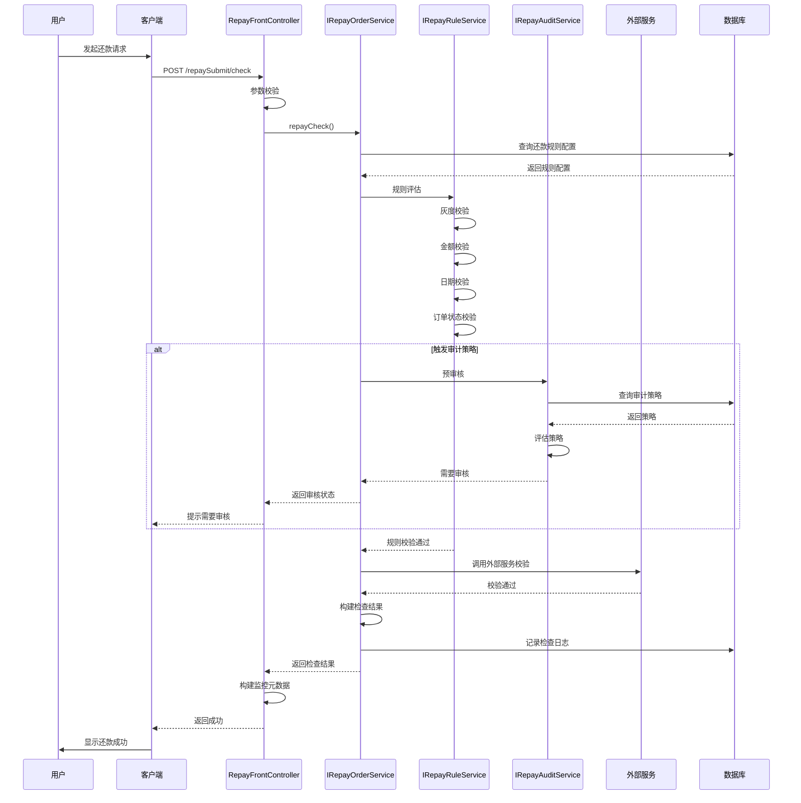
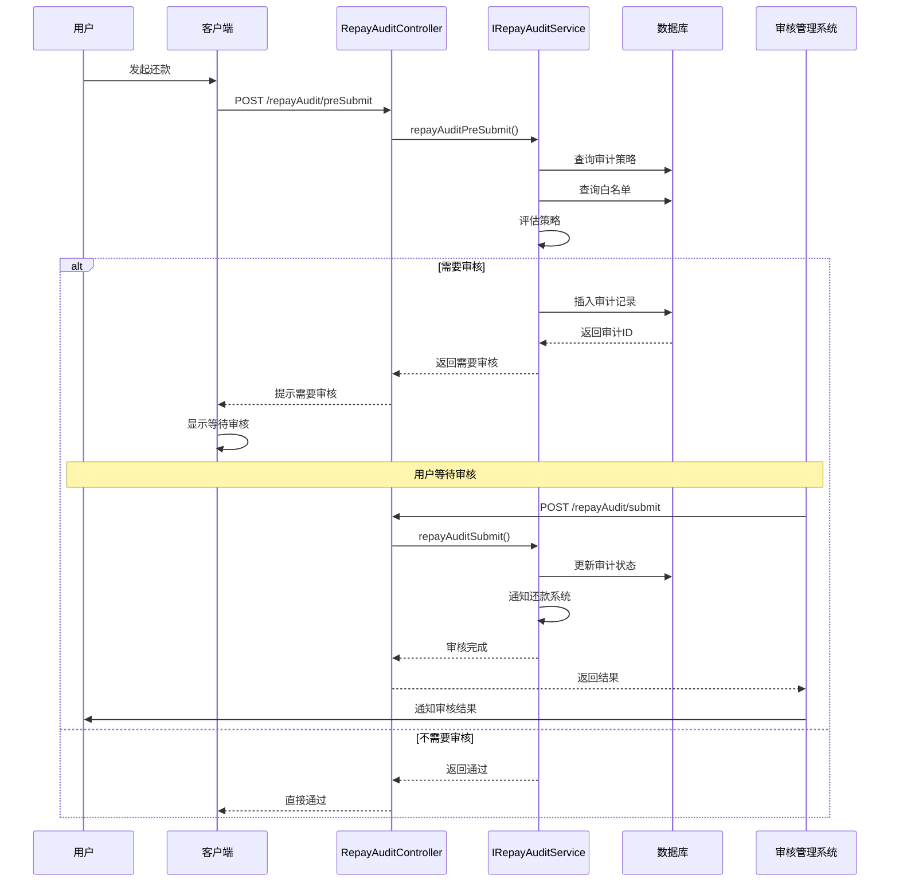
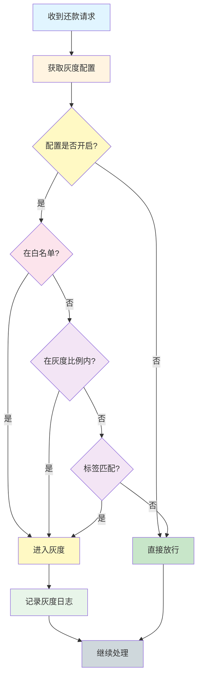

# 还款前置校验系统 - 核心流程

## 概述

本文档描述还款前置校验系统的核心业务流程和技术实现细节。

## 核心流程一：还款前置校验

### 流程描述

这是系统最核心的流程，在用户发起还款前进行全方位的校验，确保还款的合规性和安全性。

### 流程图



### 关键步骤

#### 1. 参数校验

- 校验用户 ID（uid）
- 校验业务流水号（bizSerial）
- 校验还款金额（repayAmount）
- 校验还款日期（repayDate）
- 校验还款要素列表（repayElementList）

#### 2. 规则查询

```java
// 查询还款规则配置
RepayRuleBo ruleConfig = repayRuleQueryService.query(uid, bizSerial);
```

#### 3. 规则评估

```java
// 评估还款规则
EvaluationResult result = repayRuleEvaluationService.evaluate(ruleConfig, request);
```

**评估项：**
- 灰度检查：用户是否在灰度名单
- 金额检查：还款金额是否在允许范围内
- 日期检查：还款日期是否符合规则
- 订单状态检查：订单状态是否允许还款
- 还款次数检查：今日还款次数是否超限

#### 4. 审计策略评估

```java
// 预审核
List<RepayElementPreSubmitOutput> result =
    repayAuditService.repayAuditPreSubmit(uid, bizSerial, elementList);
```

**评估逻辑：**
- 查询启用的审计策略（status = 'ENABLE'）
- 按优先级（priority）排序
- 依次匹配策略
- 如果匹配到需要审核的策略，返回需要审核

#### 5. 外部服务调用

```java
// 调用贷款核心网关
LoanInfo loanInfo = focusloancoreGateway.getLoanInfo(bizSerial);

// 调用卡引擎
CardInfo cardInfo = cardEngineClient.getCardInfo(uid);
```

**调用服务：**
- focusloancore-gateway - 贷款核心网关
- cardengine-common - 卡引擎
- channelcoreconfig - 渠道核心配置
- riskaccountengine - 风控账户引擎

#### 6. 构建响应

```java
RepaymentCheckResp resp = RepaymentCheckResp.builder()
    .bizSerial(bizSerial)
    .checkResult(true)
    .checkCode("SUCCESS")
    .checkMessage("检查通过")
    .build();
```

---

## 核心流程二：还款审核流程

### 流程描述

对于触发了审计策略的还款请求，需要走人工审核流程。

### 流程图



### 关键步骤

#### 1. 预提交

```java
List<RepayElementPreSubmitOutput> result =
    repayAuditService.repayAuditPreSubmit(uid, bizSerial, elementList);
```

#### 2. 提交审核

```java
List<RepayElementSubmitOutput> result =
    repayAuditService.repayAuditSubmit(uid, bizSerial, elementList);
```

#### 3. 审核结果查询

```java
RepayAuditResultOutput output =
    repayAuditService.repayAuditResult(input);
```

#### 4. 白名单管理

```java
// 查询白名单
RepayAuditWhiteListGetOutput output =
    repayAuditService.whiteListContainedByUid(uid, whiteType);

// 更新白名单
repayAuditService.whiteListUpdate(uid, contained, operator, whiteType);
```

---

## 核心流程三：灰度检查流程

### 流程描述

新功能上线时，通过灰度机制逐步推广，降低风险。

### 流程图



### 灰度策略

#### 1. 白名单策略

```java
// 白名单用户优先进入灰度
if (whiteListService.isInWhiteList(uid)) {
    return true;
}
```

#### 2. 比例策略

```java
// 按比例分配灰度用户
int grayPercent = config.getGrayPercent();
String hashKey = uid + bizSerial;
int hash = hash(hashKey);
return hash % 100 < grayPercent;
```

#### 3. 标签策略

```java
// 根据用户标签匹配
List<String> userTags = tagService.getUserTags(uid);
List<String> grayTags = config.getGrayTags();
return userTags.stream().anyMatch(grayTags::contains);
```

---

## 关键技术点

### 1. 分布式锁

使用 Redis 分布式锁保证并发安全：

```java
// 获取分布式锁
String lockKey = "repay:lock:" + bizSerial;
boolean locked = redisLock.tryLock(lockKey, 30, TimeUnit.SECONDS);

try {
    if (locked) {
        // 执行业务逻辑
    }
} finally {
    if (locked) {
        redisLock.unlock(lockKey);
    }
}
```

### 2. 事务管理

使用 Spring 事务管理保证数据一致性：

```java
@Transactional(rollbackFor = Exception.class)
public void repayCheck(RepaymentCheckReq req) {
    // 数据库操作
}
```

### 3. 缓存机制

使用缓存提高性能：

```java
@Cacheable(value = "repay:rule", key = "#uid + ':' + #bizSerial")
public RepayRuleBo getRule(String uid, String bizSerial) {
    // 查询数据库
}
```

### 4. 异步处理

使用线程池异步处理耗时操作：

```java
@Async("repayBizFlowExecutor")
public void asyncProcess(RepayTask task) {
    // 异步处理逻辑
}
```

## 监控和告警

### 监控指标

| 指标 | 说明 | 阈值 |
|------|------|------|
| 接口 QPS | 每秒请求数 | > 1000 |
| 接口响应时间 | 平均响应时间 | < 200ms |
| 接口成功率 | 成功请求比例 | > 99.9% |
| 审核通过率 | 审核通过比例 | 监控变化 |
| 数据库慢查询 | 慢查询次数 | < 10/min |

### 告警配置

- 接口成功率低于 99% 时告警
- 接口响应时间超过 500ms 时告警
- 数据库慢查询超过 20 次/分钟时告警
- 审核拒绝率异常波动时告警

## 相关文档

- [项目工程结构](./01-项目工程结构.md) - 了解项目架构
- [数据库结构](./02-数据库结构.md) - 了解数据存储
- [接口流程](./03-接口流程-索引.md) - 了解接口详情
- [业务流](./05-业务流.md) - 了解业务流程
