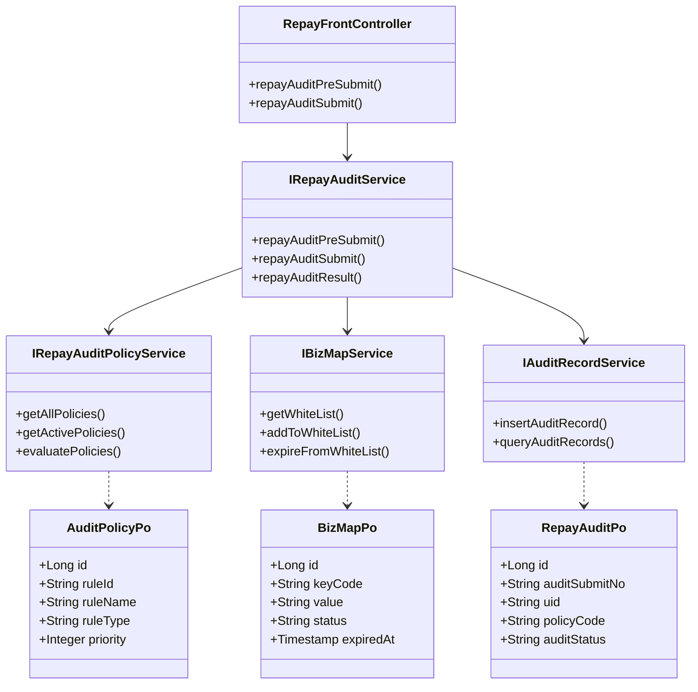
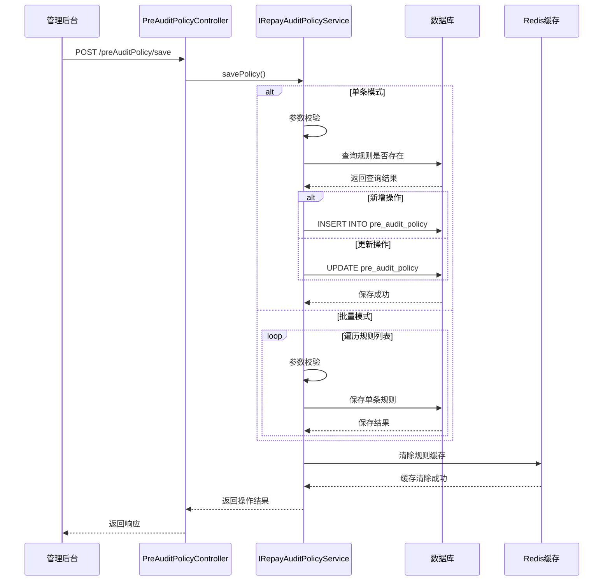
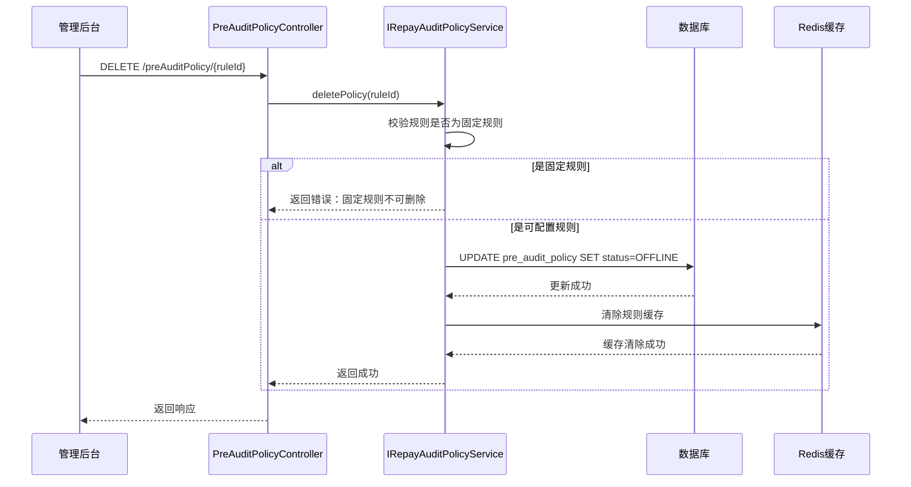
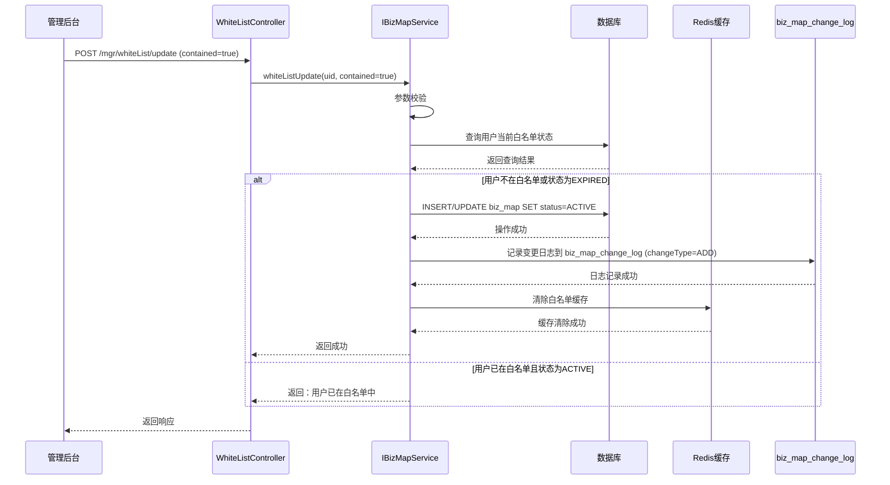
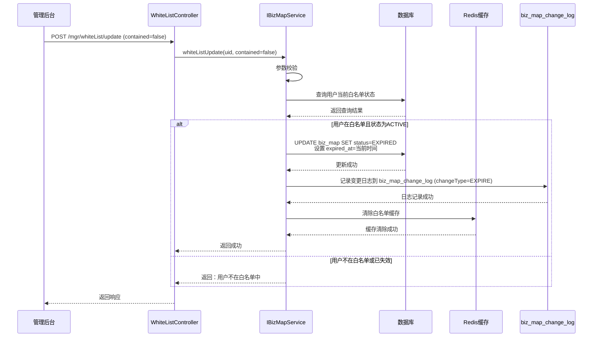
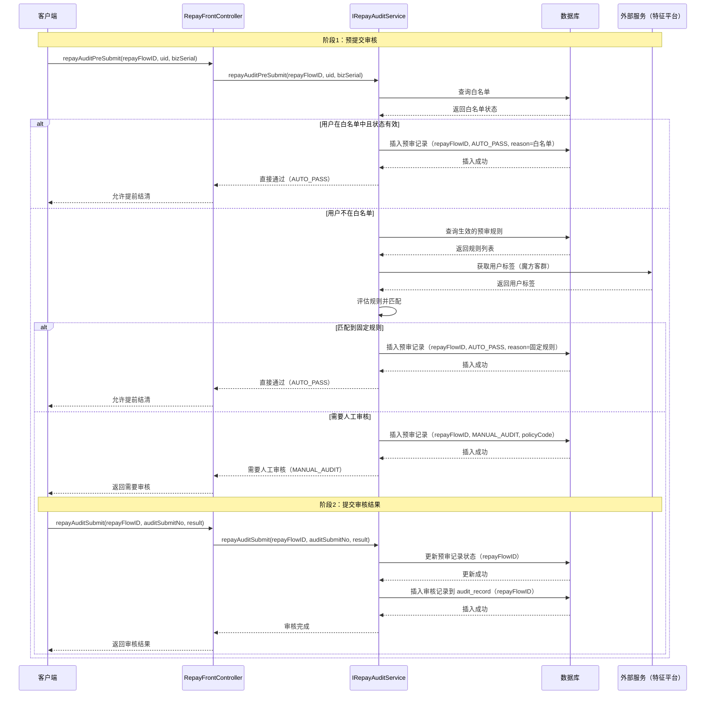

# 后端详细设计 - 提前结清实验支持

> 基于 PRD 文档《提前结清实验支持需求》（v3.0）
> 文档 ID: 414291549
> 需求优先级: P0
> 预计上线时间: 2026-Q2

---

## 目录

- [背景](#背景)
  - [需求](#需求)
  - [概要设计](#概要设计)
  - [术语表](#术语表)
  - [设计前提](#设计前提)
- [repayfront 应用功能设计](#repayfront-应用功能设计)
- [提前结清功能设计](#提前结清功能设计)
  - [功能设计](#功能设计)
  - [接口详细设计](#接口详细设计)
  - [MQ 设计](#mq-设计)
  - [配置项设计](#配置项设计)
  - [数据结构设计](#数据结构设计)

---

## 背景

### 需求

**需求文档链接：** [提前结清实验支持需求 v3.0](http://wiki.caijj.net/pages/viewpage.action?pageId=414291549)

**需求概述：**
本次需求主要针对**提前结清流程**进行优化，核心目标：

1. 降低提前结清损失率
2. 支持 AB 实验和精细化运营
3. 增强风控能力和数据追踪能力

### 概要设计

（无单独概要设计）

### 术语表

| 术语 | 解释 |
|------|------|
| 提前结清 | 用户在到期日前还清所有应还金额 |
| 白名单 | 无需审核即可提前结清的用户列表 |
| 预审规则 | 提前结清前进行审核判断的规则 |
| 固定规则 | 系统预置的审核规则，不可修改 |
| 可配置规则 | 支持通过管理后台配置的审核规则 |
| AB 实验 | 通过实验分组对比不同策略效果 |

### 设计前提

1. **数据一致性：** 白名单变更和审核规则变更需要保证数据一致性
2. **兼容性：** 新增功能需要与现有提前结清流程兼容
3. **性能考虑：** 白名单和预审规则查询需要使用缓存
4. **风控要求：** 提前结清需要严格的风控审核，避免坏账风险

---

## repayfront 应用功能设计

| 功能名 | 功能描述 | 功能分级 |
|--------|----------|----------|
| 白名单管理 | 管理提前结清白名单，支持失效机制 | B-支撑功能 |
| 预审规则管理 | 支持固定规则和可配置规则的预审规则 | A-核心功能 |
| 提前结清审核优化 | 优化提前结清审核流程，支持多规则组合 | A-核心功能 |
| 审核记录落库 | 将提前结清审核记录持久化到数据库 | A-核心功能 |
| AB 实验支持 | 支持通过白名单和预审规则进行 AB 实验 | B-支撑功能 |

---

## 「提前结清功能」设计

### 功能设计

#### 类图

##### 提前结清功能核心类图



##### 各功能核心类说明

| 类名 | 作用 | 说明 |
|------|------|------|
| RepayFrontController | 还款前置校验控制器 | 提前结清接口入口 |
| IRepayAuditService | 还款审核服务 | 提前结清审核主逻辑 |
| IRepayAuditPolicyService | 预审规则服务 | 预审规则查询和评估 |
| IBizMapService | 白名单服务 | 白名单查询和管理 |
| IAuditRecordService | 审核记录服务 | 审核记录落库和查询 |
| RepayAuditPo | 审核记录实体 | 对应数据库表 pre_audit_record |
| AuditPolicyPo | 预审规则实体 | 对应数据库表 pre_audit_policy |
| BizMapPo | 业务映射实体 | 对应数据库表 biz_map |

**设计模式说明：**

- **策略模式**：预审规则采用策略模式，支持灵活扩展
- **工厂模式**：不同类型规则采用不同评估器

---

#### 时序图

##### 预审规则新增/更新流程



##### 预审规则删除流程



##### 白名单添加流程



##### 白名单失效流程



##### 提前结清审核流程时序图



**说明：**

- `repayFlowID` 由前端生成（可选参数），用于贯穿整个提前结清流程进行全链路追踪
- 预审阶段：如有 `repayFlowID`，记录在 `pre_audit_record` 表的 `flow_id` 字段
- 审核阶段：如有 `repayFlowID`，同时更新 `pre_audit_record` 和插入 `audit_record` 的 `flow_id` 字段
- 通过 `repayFlowID` 可以关联查询完整的业务流程（如果前端提供了 repayFlowID）

##### 系统流程图说明

**场景 1：用户在白名单中**

1. 客户端调用提前结清预提交接口
2. 系统查询白名单表，判断用户是否在白名单
3. 如果在白名单且状态为 ACTIVE，直接返回 AUTO_PASS
4. 无需人工审核，用户可以直接提交提前结清

**场景 2：触发固定规则**

1. 用户不在白名单中
2. 系统查询所有生效的预审规则
3. 按优先级顺序评估规则
4. 如果匹配到固定规则（如轻资产订单、随借随还订单），返回 AUTO_PASS
5. 无需人工审核

**场景 3：需要人工审核**

1. 用户不在白名单中，且未匹配到固定规则
2. 系统将审核记录插入数据库
3. 返回 MANUAL_AUDIT 状态
4. 用户提交审核后，人工审核
5. 审核通过后，更新审核记录状态

**场景 4：白名单失效**

1. 白名单记录设置了失效时间（expired_at）
2. 白名单失效后不再生效，用户需要重新审核
3. 管理员可手动设置白名单失效

---

### 接口详细设计

#### 白名单管理接口

**【接口变更类型】** 🔄 接口更新

**【接口变更说明】**

- ✅ **接口路径调整**：从 `/repayAudit/whiteList/update` 调整为 `/mgr/whiteList/update`
- ✅ **删除方式变更**：从物理删除改为逻辑删除（contained=false 时，status 更新为 EXPIRED）
- ✅ **新增业务逻辑**：
  - 白名单记录新增 `status`、`expired_at`、`expired_reason` 字段
  - 失效操作（contained=false）记录变更日志到 `biz_map_change_log` 表
  - 变更时直接清除缓存（不使用 MQ）
- ✅ **兼容性说明**：接口参数保持不变，向后兼容

**【接口定义参数规范】**

**接口路径：** POST /mgr/whiteList/update
**原接口路径：** POST /repayAudit/whiteList/update
**接口描述：** 白名单管理，支持新增、失效（从物理删除改造为逻辑删除）

**【请求参数】**

| 参数名 | 类型 | 必填 | 说明 | 约束 |
|--------|------|------|------|------|
| uid | String | 是 | 用户 ID | 非空，长度 ≤ 50 |
| contained | Boolean | 是 | 是否包含在白名单中 | true=新增，false=失效 |
| operator | String | 否 | 白名单操作人 | 长度 ≤ 50 |
| whiteType | String | 否 | 白名单类型 | 枚举：UID_WHITE_LIST（默认）、ALIPAY_UID_WHITE_LIST |

**参数说明：**

- `contained=true`：新增用户到白名单（status=ACTIVE）
- `contained=false`：将用户从白名单失效（status=EXPIRED，记录失效原因）

**【响应参数】**

| 参数名 | 类型 | 说明 |
|--------|------|------|
| success | Boolean | 是否成功 |
| message | String | 结果消息 |

**【接口评估】**

- **预估最高 QPS：** 50 QPS
- **是否有大请求 body：** 否
- **是否有熔断和限流：** 是，使用 Sentinel 限流
- **降级方案：** 数据库异常时，记录日志后返回失败
- **是否有异常抛出：** 是，业务异常抛出 BizException
- **是否返回 null 对象：** 否
- **接口变更影响：** 基于现有接口改造：1）物理删除改为逻辑删除；2）新增变更日志记录；3）新增 MQ 缓存清除机制

---

#### 预审规则管理接口

##### 1. 预审规则列表查询

**【接口变更类型】** ✅ 新增接口

**【接口定义参数规范】**

**接口路径：** GET /preAuditPolicy/list
**接口描述：** 查询预审规则列表（支持分页、状态筛选，包含规则详情）

**【请求参数】**

| 参数名 | 类型 | 必填 | 说明 | 约束 |
|--------|------|------|------|------|
| pageNum | Integer | 否 | 页码 | 默认值：1，≥1 |
| pageSize | Integer | 否 | 每页大小 | 默认值：10，1-100 |
| status | String | 否 | 规则状态 | 枚举：ONLINE, OFFLINE |
| ruleType | String | 否 | 规则类型 | 枚举：FIXED, CUSTOM |

**【响应参数】**

| 参数名 | 类型 | 说明 |
|--------|------|------|
| total | Integer | 总记录数 |
| pageNum | Integer | 当前页码 |
| pageSize | Integer | 每页大小 |
| list | Array&lt;AuditPolicyInfo&gt; | 规则列表 |

**AuditPolicyInfo 参数：**

| 参数名 | 类型 | 说明 |
|--------|------|------|
| ruleId | String | 规则 ID |
| ruleName | String | 规则名称 |
| ruleType | String | 规则类型：FIXED-固定规则，CUSTOM-可配置规则 |
| priority | Integer | 优先级 |
| ruleCondition | String | 规则条件（JSON 格式） |
| status | String | 规则状态：ONLINE-上线，OFFLINE-下线 |
| description | String | 规则描述 |
| createdAt | Timestamp | 创建时间 |
| updatedAt | Timestamp | 更新时间 |

**【接口评估】**

- **预估最高 QPS：** 50 QPS
- **是否有大请求 body：** 否
- **是否有熔断和限流：** 是，使用 Sentinel 限流
- **降级方案：** 数据库异常时，返回空列表
- **是否有异常抛出：** 是，业务异常抛出 BizException
- **是否返回 null 对象：** 否，list 默认为空数组
- **接口变更影响：** 新增接口，不影响现有功能

---

##### 2. 预审规则新增/更新（支持批量）

**【接口变更类型】** ✅ 新增接口

**【接口定义参数规范】**

**接口路径：** POST /preAuditPolicy/save
**接口描述：** 新增或更新预审规则（仅限可配置规则，支持批量操作）

**【请求参数】**

| 参数名 | 类型 | 必填 | 说明 | 约束 |
|--------|------|------|------|------|
| batchMode | Boolean | 否 | 是否批量模式 | 默认值：false |
| rules | Array&lt;PolicyRuleInfo&gt; | 条件 | 规则列表 | 批量模式时必填，最多 50 条 |
| operationType | String | 条件 | 操作类型：ADD, UPDATE | 单条模式时必填 |
| ruleId | String | 条件 | 规则 ID（更新时必填） | 单条模式时必填，长度 ≤ 50 |
| ruleName | String | 条件 | 规则名称 | 单条模式时必填，长度 ≤ 100 |
| ruleType | String | 条件 | 规则类型：FIXED, CUSTOM | 单条模式时必填，枚举值 |
| priority | Integer | 条件 | 优先级 | 单条模式时必填，范围 1-100 |
| ruleCondition | String | 条件 | 规则条件 | 单条模式时必填，JSON 格式 |
| status | String | 条件 | 规则状态：ONLINE, OFFLINE | 单条模式时必填，枚举值 |
| description | String | 否 | 规则描述 | 长度 ≤ 500 |
| operator | String | 是 | 操作人 | 非空，长度 ≤ 50 |

**PolicyRuleInfo 参数（批量模式）：**

| 参数名 | 类型 | 必填 | 说明 | 约束 |
|--------|------|------|------|------|
| operationType | String | 是 | 操作类型：ADD, UPDATE | 非空，枚举值 |
| ruleId | String | 否 | 规则 ID（更新时必填） | 长度 ≤ 50 |
| ruleName | String | 是 | 规则名称 | 非空，长度 ≤ 100 |
| ruleType | String | 是 | 规则类型：FIXED, CUSTOM | 非空，枚举值 |
| priority | Integer | 是 | 优先级 | 非空，范围 1-100 |
| ruleCondition | String | 是 | 规则条件 | 非空，JSON 格式 |
| status | String | 是 | 规则状态：ONLINE, OFFLINE | 非空，枚举值 |
| description | String | 否 | 规则描述 | 长度 ≤ 500 |

**【响应参数】**

| 参数名 | 类型 | 说明 |
|--------|------|------|
| success | Boolean | 是否成功（全部成功则为 true） |
| message | String | 结果消息 |
| totalCount | Integer | 总操作数量 |
| successCount | Integer | 成功数量 |
| failCount | Integer | 失败数量 |
| results | Array&lt;PolicyResultInfo&gt; | 操作结果列表 |
| ruleId | String | 规则 ID（单条模式新增成功后返回） |

**PolicyResultInfo 参数（批量模式）：**

| 参数名 | 类型 | 说明 |
|--------|------|------|
| index | Integer | 批量操作中的索引 |
| operationType | String | 操作类型 |
| ruleId | String | 规则 ID |
| ruleName | String | 规则名称 |
| success | Boolean | 是否成功 |
| message | String | 结果消息 |

**【接口评估】**

- **预估最高 QPS：** 20 QPS（单条），10 QPS（批量）
- **是否有大请求 body：** 批量模式下，最大约 50KB（50 条规则）
- **是否有熔断和限流：** 是，使用 Sentinel 限流
- **降级方案：** 数据库异常时，记录日志后返回失败
- **是否有异常抛出：** 是，业务异常抛出 BizException
- **是否返回 null 对象：** 否
- **接口变更影响：** 新增接口，不影响现有功能
- **事务处理：** 批量模式下，单条失败不影响其他规则的保存

---

##### 3. 预审规则删除

**【接口变更类型】** ✅ 新增接口

**【接口定义参数规范】**

**接口路径：** DELETE /preAuditPolicy/{ruleId}
**接口描述：** 删除预审规则（仅限可配置规则，删除时更新为 OFFLINE）

**【请求参数】**

| 参数名 | 类型 | 必填 | 说明 | 约束 |
|--------|------|------|------|------|
| ruleId | String | 是 | 规则 ID | 路径参数，非空 |
| operator | String | 是 | 操作人 | Query 参数，非空，长度 ≤ 50 |

**【响应参数】**

| 参数名 | 类型 | 说明 |
|--------|------|------|
| success | Boolean | 是否成功 |
| message | String | 结果消息 |

**【接口评估】**

- **预估最高 QPS：** 10 QPS
- **是否有大请求 body：** 否
- **是否有熔断和限流：** 是，使用 Sentinel 限流
- **降级方案：** 数据库异常时，记录日志后返回失败
- **是否有异常抛出：** 是，业务异常抛出 BizException
- **是否返回 null 对象：** 否
- **接口变更影响：** 新增接口，不影响现有功能

---

#### 提前结清审核接口

##### 1. 提前结清预审接口

**【接口变更类型】** 🔄 接口更新

**【接口变更说明】**

- ✅ **新增请求参数**：`repayFlowID`（String，非必填）- 业务流水号，用于全链路追踪
- ✅ **新增响应参数**：`repayFlowID`（String）- 返回业务流水号
- ✅ **新增业务逻辑**：预审记录落库到 `pre_audit_record` 表（包含 repayFlowID，如有）

**【接口定义参数规范】**

**接口路径：** POST /repayAudit/preSubmit
**接口描述：** 提前结清预提交，判断是否需要人工审核，并记录预审结果

**【请求参数】**

| 参数名 | 类型 | 必填 | 说明 | 约束 |
|--------|------|------|------|------|
| repayFlowID | String | 否 | 业务流水号 | 长度 ≤ 50，用于全链路追踪 |
| uid | String | 是 | 用户 ID | 非空，长度 ≤ 50 |
| bizSerial | String | 是 | 业务流水号 | 非空，长度 ≤ 50 |
| repayElementList | Array&lt;RepayElementInfo&gt; | 是 | 还款要素列表 | 非空，最多 10 个要素 |

**RepayElementInfo 参数：**

| 参数名 | 类型 | 必填 | 说明 | 约束 |
|--------|------|------|------|------|
| repayElementNo | String | 是 | 还款要素编号 | 非空，长度 ≤ 50 |
| repayAmount | BigDecimal | 是 | 还款金额 | 非空，精度 2 位小数 |
| repayCategory | String | 是 | 还款分类 | 非空，枚举：STAGE, BILL |

**【响应参数】**

| 参数名             | 类型                           | 说明             |
| --------------- | ---------------------------- | -------------- |
| bizSerial       | String                       | 业务流水号          |
| repayFlowID          | String                       | 业务流水号（用于全链路追踪） |
| auditResultList | Array&lt;AuditResultInfo&gt; | 审核结果列表         |

**AuditResultInfo 参数：**

| 参数名 | 类型 | 说明 |
|--------|------|------|
| repayElementNo | String | 还款要素编号 |
| auditStatus | String | 审核状态：AUTO_PASS, MANUAL_AUDIT, EXCEED_LIMIT |
| policyCode | String | 匹配的策略编码（如不需要审核则为空） |
| policyName | String | 策略名称（如不需要审核则为空） |
| message | String | 审核消息 |

**【业务逻辑】**

1. **参数校验**：校验 uid、bizSerial 等必填参数
2. **白名单检查**：查询用户是否在白名单中（状态为 ACTIVE 或 NULL）
3. **预审规则匹配**：
   - 按优先级顺序评估固定规则（白名单、轻资产订单、随借随还订单、当天审核通过）
   - 按优先级顺序评估可配置规则
   - 匹配到第一条规则后停止匹配
4. **预审记录落库**：将预审结果保存到 `pre_audit_record` 表（包含 repayFlowID，如有）
5. **返回预审结果**：返回审核状态及匹配的策略信息

**【接口评估】**

- **预估最高 QPS：** 100 QPS
- **是否有大请求 body：** 否，请求体较小
- **是否有熔断和限流：** 是，使用 Sentinel 进行限流
- **降级方案：** 预审规则服务异常时，降级到默认规则（需要人工审核）
- **是否有异常抛出：** 是，业务异常抛出 BizException
- **是否返回 null 对象：** 否，始终返回非空对象
- **接口变更影响：** 新增 repayFlowID 参数（非必填），新增预审记录落库逻辑

---

##### 2. 提前结清审核接口

**【接口变更类型】** 🔄 接口更新

**【接口变更说明】**

- ✅ **新增请求参数**：`repayFlowID`（String，非必填）- 业务流水号，用于全链路追踪
- ✅ **新增响应参数**：`repayFlowID`（String）- 返回业务流水号
- ✅ **新增业务逻辑**：
	- 根据 repayFlowID 查询预审记录（可选）
	- 更新 `pre_audit_record` 表的审核状态（根据 repayFlowID，如有）
	- 审核记录落库到 `audit_record` 表（包含 repayFlowID，如有）

**【接口定义参数规范】**

**接口路径：** POST /repayAudit/submit
**接口描述：** 提前结清人工审核提交，记录审核结果

**【请求参数】**

| 参数名 | 类型 | 必填 | 说明 | 约束 |
|--------|------|------|------|------|
| repayFlowID | String | 否 | 业务流水号 | 长度 ≤ 50，用于全链路追踪 |
| uid | String | 是 | 用户 ID | 非空，长度 ≤ 50 |
| repayElementNo | String | 是 | 还款要素编号 | 非空，长度 ≤ 50 |
| auditAction | String | 是 | 审核动作 | 非空，枚举：ACCEPT-通过，REJECT-拒绝 |
| auditComment | String | 否 | 审核意见 | 长度 ≤ 500 |

**【响应参数】**

| 参数名 | 类型 | 说明 |
|--------|------|------|
| repayFlowID | String | 业务流水号 |
| auditSubmitNo | String | 审核提交单号 |
| auditStatus | String | 审核状态：ACCEPTED-已通过，REJECTED-已拒绝 |
| message | String | 结果消息 |

**【业务逻辑】**

1. **参数校验**：校验 uid、repayElementNo、auditAction 等必填参数
2. **查询预审记录**：根据 repayFlowID 查询 `pre_audit_record` 表，获取预审结果（如有 repayFlowID）
3. **审核判断**：根据 auditAction 确定审核结果
4. **更新预审记录**：更新 `pre_audit_record` 表的审核状态（根据 repayFlowID，如有）
5. **审核记录落库**：将审核结果保存到 `audit_record` 表（包含 repayFlowID，如有）
6. **返回审核结果**：返回审核状态及提交单号

**【接口评估】**

- **预估最高 QPS：** 50 QPS
- **是否有大请求 body：** 否，请求体较小
- **是否有熔断和限流：** 是，使用 Sentinel 限流
- **降级方案：** 数据库异常时，记录日志后返回失败
- **是否有异常抛出：** 是，业务异常抛出 BizException
- **是否返回 null 对象：** 否
- **接口变更影响：** 新增 repayFlowID 参数（非必填），新增预审记录更新逻辑

---

### 配置项设计

#### 配置项列表

| 配置编码 | 配置名称 | 配置类型 | 默认值 | 说明 |
|---------|---------|---------|---------|------|
| audit.enabled | 提前结清审核开关 | Boolean | true | 提前结清审核总开关，关闭后所有提前结清无需审核 |
| audit.whitelist.enabled | 白名单功能开关 | Boolean | true | 白名单功能开关 |
| audit.policy.cache.ttl | 预审规则缓存过期时间 | Integer | 600 | 预审规则缓存时间（秒），默认 10 分钟 |
| audit.whitelist.cache.ttl | 白名单缓存过期时间 | Integer | 600 | 白名单缓存时间（秒），默认 10 分钟 |
| audit.whitelist.expireCheck.enabled | 白名单失效检查开关 | Boolean | true | 是否启用白名单失效时间检查 |
| audit.abExperiment.enabled | AB 实验功能开关 | Boolean | false | AB 实验功能开关 |

#### 配置项设计说明

**1. audit.enabled（提前结清审核开关）**

- **必要性：** 必需，用于紧急情况快速关闭审核
- **可维护性：** 布尔值，易于理解
- **稳定性：** 配置变更后立即生效，无需重启

**2. audit.policy.cache.ttl（预审规则缓存过期时间）**

- **必要性：** 必需，提高查询性能，减少数据库压力
- **可维护性：** 单位为秒，配置清晰
- **稳定性：** 使用 Redis 缓存，过期后自动刷新
- **缓存同步：** 预审规则变更时，清除缓存

**3. audit.whitelist.cache.ttl（白名单缓存过期时间）**

- **必要性：** 必需，提高白名单查询性能
- **可维护性：** 单位为秒，配置清晰
- **稳定性：** 使用 Redis 缓存，过期后自动刷新
- **缓存同步：** 白名单变更时，清除缓存

**4. audit.whiteList.expireCheck.enabled（白名单失效检查开关）**

- **必要性：** 必需，支持白名单失效机制
- **可维护性：** 布尔值，易于理解
- **稳定性：** 启用后白名单失效时间生效

**5. audit.abExperiment.enabled（AB 实验功能开关）**

- **必要性：** 非必需，用于 AB 实验
- **可维护性：** 布尔值，易于理解
- **稳定性：** 关闭时不影响现有功能

---

### 数据结构设计

#### 数据库表设计

##### 1. 白名单表（biz_map）

**表名：** `repayfront.biz_map`

**改动类型：** 字段新增

**新增字段：**

| 字段名 | 类型 | 必填 | 说明 | 备注 |
|--------|------|------|------|------|
| status | VARCHAR(20) | 是 | 白名单状态：ACTIVE-生效中，EXPIRED-已失效 | 默认值：ACTIVE |
| expired_at | TIMESTAMP | 否 | 失效时间 | NULL 表示永久生效 |
| expired_reason | VARCHAR(200) | 否 | 失效原因 | 手动失效时填写 |

**新增索引：**

```sql
CREATE INDEX idx_status ON repayfront.biz_map(status);
CREATE INDEX idx_expired_at ON repayfront.biz_map(expired_at);
```

**表数据增量情况评估：**

- 每天预计增加：100-500 行（白名单新增）

---

##### 2. 白名单变更记录表（biz_map_change_log）

**表名：** `repayfront.biz_map_change_log`

**改动类型：** 新建表

**表结构：**

| 字段名 | 类型 | 必填 | 说明 | 备注 |
|--------|------|------|------|------|
| id | BIGINT(20) | 是 | 主键 | 自增 |
| user_id | VARCHAR(50) | 是 | 用户 ID |  |
| order_id | VARCHAR(50) | 是 | 订单 ID |  |
| change_type | VARCHAR(20) | 是 | 变更类型：ADD-新增，EXPIRE-失效 |  |
| change_reason | VARCHAR(200) | 是 | 变更原因 |  |
| source_system | VARCHAR(50) | 是 | 来源系统 |  |
| operator | VARCHAR(50) | 是 | 操作人 |  |
| created_by | VARCHAR(150) | 是 | 创建人 | 默认值：SYS |
| updated_by | VARCHAR(150) | 是 | 更新人 | 默认值：SYS |
| created_at | TIMESTAMP | 是 | 创建时间 | 默认值：CURRENT_TIMESTAMP |
| updated_at | TIMESTAMP | 是 | 更新时间 | 默认值：CURRENT_TIMESTAMP ON UPDATE CURRENT_TIMESTAMP |

**索引：**

```sql
PRIMARY KEY (id),
INDEX idx_user_order (user_id, order_id),
INDEX idx_change_type (change_type),
INDEX idx_created_at (created_at)
```

**表数据增量情况评估：**

- 每天预计增加：200-1000 行（白名单变更记录）

---

##### 3. 预审规则表（pre_audit_policy）

**表名：** `repayfront.pre_audit_policy`

**改动类型：** 新建表

**表结构：**

| 字段名 | 类型 | 必填 | 说明 | 备注 |
|--------|------|------|------|------|
| id | BIGINT(20) | 是 | 主键 | 自增 |
| rule_id | VARCHAR(50) | 是 | 规则 ID（唯一标识） | 唯一键 |
| rule_name | VARCHAR(100) | 是 | 规则名称 |  |
| rule_type | VARCHAR(20) | 是 | 规则类型：FIXED-固定规则，CUSTOM-可配置规则 |  |
| priority | INT | 是 | 优先级（数字越小优先级越高） | 固定规则：1-10，可配置规则：11-100 |
| rule_condition | TEXT | 是 | 规则条件 | JSON 格式，存储规则特征配置 |
| status | VARCHAR(20) | 是 | 规则状态：ONLINE-上线，OFFLINE-下线 | 默认值：ONLINE |
| description | VARCHAR(500) | 否 | 规则描述 |  |
| created_by | VARCHAR(150) | 是 | 创建人 | 默认值：SYS |
| updated_by | VARCHAR(150) | 是 | 更新人 | 默认值：SYS |
| created_at | TIMESTAMP | 是 | 创建时间 | 默认值：CURRENT_TIMESTAMP |
| updated_at | TIMESTAMP | 是 | 更新时间 | 默认值：CURRENT_TIMESTAMP ON UPDATE CURRENT_TIMESTAMP |

**索引：**

```sql
PRIMARY KEY (id),
UNIQUE KEY uk_rule_id (rule_id),
INDEX idx_rule_type (rule_type),
INDEX idx_priority (priority),
INDEX idx_status (status),
INDEX idx_created_at (created_at)
```

**预置固定规则数据：**

```sql
-- 规则 1：白名单匹配
INSERT INTO repayfront.pre_audit_policy (rule_id, rule_name, rule_type, priority, rule_condition, description) VALUES
('WHITELIST', '白名单匹配', 'FIXED', 1, '{"field":"whitelist","operator":"in","value":"whitelist_table"}', '白名单状态为 ACTIVE 或 NULL 的用户，无需审核');

-- 规则 2：轻资产订单
INSERT INTO repayfront.pre_audit_policy (rule_id, rule_name, rule_type, priority, rule_condition, description) VALUES
('SEAMLESS_V2', '轻资产订单', 'FIXED', 2, '{"field":"assetBank","operator":"in","value":["seamless_v2"]}', '符合轻资产订单特征的用户，无需审核');

-- 规则 3：随借随还订单
INSERT INTO repayfront.pre_audit_policy (rule_id, rule_name, rule_type, priority, rule_condition, description) VALUES
('ANY_REPAY', '随借随还订单', 'FIXED', 3, '{"field":"product","operator":"equals","value":"ANY_REPAY"}', '随借随还订单类型的用户，无需审核');

-- 规则 4：当天订单审核通过后二次发起
INSERT INTO repayfront.pre_audit_policy (rule_id, rule_name, rule_type, priority, rule_condition, description) VALUES
('SAME_DAY_APPROVED', '当天订单审核通过后二次发起', 'FIXED', 4, '{"field":"auditRecord","operator":"sameDayApproved"}', '当天订单提前结清审核通过后，二次发起提前结清，无需审核');
```

**表数据增量情况评估：**

- 初始化：4 条固定规则
- 后续新增：10-50 条/月（可配置规则）

---

##### 4. 预审记录表（pre_audit_record）

**表名：** `repayfront.pre_audit_record`

**改动类型：** 新建表

**表结构：**

| 字段名 | 类型 | 必填 | 说明 | 备注 |
|--------|------|------|------|------|
| id | BIGINT(20) | 是 | 主键 | 自增 |
| flow_id | VARCHAR(50) | 否 | 业务流水号 | 全链路追踪，由前端生成并传递，可为空 |
| audit_submit_no | VARCHAR(50) | 是 | 审计提交单号 | 唯一键 |
| biz_serial | VARCHAR(50) | 是 | 业务流水号 |  |
| uid | VARCHAR(50) | 是 | 用户 ID |  |
| applicant_type | VARCHAR(20) | 是 | 申请人类型 |  |
| applicant_id | VARCHAR(50) | 是 | 申请人 ID |  |
| audit_biz_type | VARCHAR(20) | 是 | 审计业务类型 |  |
| repay_category | VARCHAR(20) | 是 | 还款分类 |  |
| repay_element_no | VARCHAR(50) | 是 | 还款要素编号 |  |
| policy_code | VARCHAR(50) | 是 | 策略编码 | 匹配的规则 ID |
| policy_capture_info | CHAR | 是 | 策略捕获信息 | JSON 格式 |
| policy_match_action | VARCHAR(50) | 是 | 策略匹配动作 |  |
| audit_status | VARCHAR(20) | 是 | 审计状态 |  |
| audit_status_code | VARCHAR(50) | 是 | 审计状态码 |  |
| approver_type | VARCHAR(20) | 否 | 审批人类型 |  |
| approver_id | VARCHAR(50) | 否 | 审批人 ID |  |
| approver_remark | VARCHAR(500) | 否 | 审批备注 |  |
| audit_submit_time | TIMESTAMP | 是 | 审计提交时间 |  |
| audit_finish_time | TIMESTAMP | 否 | 审计完成时间 |  |
| edition | INTEGER | 是 | 版本号 | 乐观锁版本控制 |
| created_at | TIMESTAMP | 是 | 创建时间 | 默认值：CURRENT_TIMESTAMP |
| created_by | VARCHAR(150) | 是 | 创建人 | 默认值：SYSTEM |
| updated_at | TIMESTAMP | 是 | 更新时间 | 默认值：CURRENT_TIMESTAMP ON UPDATE CURRENT_TIMESTAMP |
| updated_by | VARCHAR(150) | 是 | 更新人 |  |

**索引：**

```sql
PRIMARY KEY (id),
UNIQUE KEY uk_audit_submit_no (audit_submit_no),
INDEX idx_flow_id (flow_id),
INDEX idx_biz_serial (biz_serial),
INDEX idx_uid (uid),
INDEX idx_policy_code (policy_code),
INDEX idx_audit_status (audit_status),
INDEX idx_created_at (created_at)
```

**说明：**

- `flow_id` 字段用于全链路追踪，由前端生成并传递，贯穿预审、审核、还款全流程
- 通过 `flow_id` 可以在 `pre_audit_record` 和 `audit_record` 表中关联同一笔业务的完整记录

**表数据增量情况评估：**

- 每天预计增加：1000-5000 行（提前结清审核记录）

---

##### 5. 审核记录表（audit_record）

**表名：** `repayfront.audit_record`

**改动类型：** 字段新增

**新增字段：**

| 字段名 | 类型 | 必填 | 说明 | 备注 |
|--------|------|------|------|------|
| flow_id | VARCHAR(50) | 否 | 业务流水号 | 用于全链路追踪，由前端生成并传递，可为空 |

**表数据增量情况评估：**

- 每天预计增加：1000-5000 行（提前结清审核记录）

---

#### 埋点设计说明

**埋点目的：** 记录提前结清审核全链路数据，支持数据分析和问题排查

**埋点实现方式：** 通过在现有记录表中增加业务流水号（repayFlowID）实现全链路追踪

**repayFlowID 传递流程：**

1. **前端生成 repayFlowID**：用户发起提前结清时，前端生成唯一的业务流水号 repayFlowID
2. **预审阶段**：repayFlowID 传递到预审接口，记录在 `pre_audit_record` 表的 `flow_id` 字段
3. **审核阶段**：repayFlowID 继续传递到审核接口，记录在 `audit_record` 表的 `flow_id` 字段
4. **还款阶段**：repayFlowID 传递到还款接口，用于关联还款记录

**关联查询示例：**

```sql
-- 通过 repayFlowID 查询全流程记录
SELECT
    pre.flow_id AS flow_id,
    pre.audit_status AS pre_audit_status,
    pre.policy_code AS matched_policy,
    aud.audit_status AS final_audit_status,
    aud.approver_id AS approver
FROM pre_audit_record pre
LEFT JOIN audit_record aud ON pre.flow_id = aud.flow_id
WHERE pre.flow_id = 'FLOW20260302123456789';
```

**埋点数据覆盖范围：**

| 阶段 | 记录表 | repayFlowID 字段 | 追踪内容 |
|------|--------|-------------|----------|
| 预审 | pre_audit_record | flow_id | 预审请求、规则匹配、预审结果 |
| 审核 | audit_record | flow_id | 审核提交、审核结果、审批人信息 |

**日志记录：**

除数据库记录外，系统日志中也会记录 repayFlowID 用于问题排查：

```json
{
  "repayFlowID": "FLOW20260302123456789",
  "uid": "user123456",
  "event": "pre_audit_request",
  "timestamp": "2026-03-02 12:00:00",
  "auditStatus": "AUTO_PASS",
  "matchedPolicy": "WHITELIST"
}
```

---

#### 数据库表结构变更影响性分析

**存量数据评估：**
1. `biz_map` 表：预计有 10,000+ 行白名单记录
2. 新增字段 `status`：默认值为 'ACTIVE'，不影响存量数据
3. 新增字段 `expired_at`：默认值为 NULL，不影响存量数据
4. 新增字段 `expired_reason`：默认值为 NULL，不影响存量数据
5. 新增索引 `idx_status` 和 `idx_expired_at`：需要执行时间较长，建议在低峰期执行
6. `audit_record` 表：现有审核记录表，新增 `flow_id` 字段，历史数据该字段默认为空

**新增表评估：**
1. `biz_map_change_log` 表：新建表，无存量数据
2. `pre_audit_policy` 表：新建表，初始化 4 条固定规则
3. `pre_audit_record` 表：新建表，无存量数据，包含 `flow_id` 字段设计

**数据迁移建议：**
1. 新增字段建议在业务低峰期执行
2. 新增表可以随时创建，不影响线上业务
3. 索引创建建议在业务低峰期执行
4. 初始化脚本需要确认规则配置正确性
5. `audit_record` 表新增 `flow_id` 字段后，历史数据该字段默认为空，不影响现有业务

---

## 运维设计

### 部署说明

1. **灰度发布：** 建议先在 1% 的流量上灰度，观察 1-2 天
2. **全量发布：** 灰度无误后，可以全量发布
3. **回滚方案：** 如果出现问题，可以通过配置开关 `audit.enabled` 快速回滚到旧逻辑

### 监控指标

| 监控项 | 告警阈值 | 说明 |
|---------|----------|------|
| 提前结清预审接口响应时间 | P99 > 500ms | 接口响应时间 |
| 提前结清预审接口成功率 | < 99.9% | 接口成功率 |
| 白名单查询耗时 | P99 > 100ms | 白名单查询性能 |
| 预审规则查询耗时 | P99 > 100ms | 预审规则查询性能 |
| 数据库慢查询 | > 100ms | 数据库查询性能 |
| 白名单失效记录数 | > 1000/天 | 异常失效告警 |
| pre_audit_record 表写入延迟 | P99 > 1s | 预审记录写入性能 |
| audit_record 表写入延迟 | P99 > 1s | 审核记录写入性能 |
| repayFlowID 关联查询失败率 | > 0.1% | 跨表关联查询可用性（仅当提供 repayFlowID 时统计） |

### 日志规范

| 日志类型 | 日志级别 | 说明 |
|---------|---------|------|
| 提前结清预审日志 | INFO | 记录预审过程和结果（包含 repayFlowID） |
| 白名单变更日志 | INFO | 记录白名单新增和失效 |
| 预审规则变更日志 | INFO | 记录规则新增和变更 |
| 审核记录落库日志 | INFO | 记录审核记录落库（包含 repayFlowID） |
| repayFlowID 追踪日志 | INFO | 记录全链路 repayFlowID 传递过程 |
| repayFlowID 异常日志 | ERROR | 记录 repayFlowID 为空或关联查询失败等异常 |
| 异常日志 | ERROR | 记录业务异常和系统异常 |

**日志格式示例：**

```json
{
  "timestamp": "2026-03-02 12:00:00.123",
  "level": "INFO",
  "logger": "com.shuhe.repayfront.service.RepayAuditService",
  "message": "提前结清预审完成",
  "repayFlowID": "FLOW20260302123456789",
  "uid": "user123456",
  "auditStatus": "AUTO_PASS",
  "matchedPolicy": "WHITELIST",
  "cost": 45
}
```

---

## 权限设计

### 功能权限

| 功能模块 | 权限编码 | 权限说明 |
|---------|---------|---------|
| 白名单管理 | audit:whitelist:manage | 白名单新增、失效、查询 |
| 预审规则管理 | audit:policy:manage | 预审规则新增、更新、下线、查询 |
| 审核记录查询 | audit:record:query | 审核记录查询 |

### 数据权限

| 数据范围 | 权限说明 |
|---------|---------|
| 全部数据 | 可以查询所有用户的审核记录 |
| 本机构数据 | 只能查询本机构的审核记录 |
| 本部门数据 | 只能查询本部门的审核记录 |

---

## 技术改造识别

### 新增依赖

- **无新增依赖**，使用现有技术栈

### 技术升级

- **无技术升级**，保持现有技术栈

### 性能优化

1. **白名单缓存**：白名单查询使用 Redis 缓存，TTL 600 秒
2. **预审规则缓存**：预审规则查询使用 Redis 缓存，TTL 600 秒
3. **索引优化**：为新增的字段创建索引
4. **批量查询**：审核记录查询支持分页，避免全表扫描

### 安全加固

1. **参数校验**：所有接口参数进行严格校验
2. **SQL 注入防护**：使用 MyBatis 参数化查询
3. **权限控制**：所有管理接口需要鉴权
4. **操作日志**：所有白名单和规则变更记录日志
5. **审计追踪**：审核记录支持追溯

---

## 附录

### 参考资料

1. [repayfront 改动点总结](./repayfront改动点总结.md)
2. [审核记录表改造说明](./审核记录表改造说明.md)
3. [白名单失效机制改造说明](./白名单失效机制改造说明.md)
4. [预审规则固定规则初始化脚本](./预审规则固定规则初始化脚本.sql)
5. [预审规则字段命名规范](./预审规则字段命名规范.md)
6. [预审规则接口优化说明](./预审规则接口优化说明.md)
7. [预审规则配置化设计说明](./预审规则配置化设计说明.md)
8. [预审记录落库实现说明](./预审记录落库实现说明.md)

### 版本历史

| 版本号 | 修改日期 | 修改人 | 修改说明 |
|--------|---------|--------|---------|
| v1.0 | 2026-03-02 | repayfront-dev | 初始版本 |
| v1.1 | 2026-03-02 | repayfront-dev | 更新设计：1）删除调度任务，改为接口触发；2）补充完整的3个预审规则管理接口；3）新增白名单清理和缓存同步接口 |
| v1.2 | 2026-03-02 | repayfront-dev | 预审规则新增/更新接口支持批量操作 |
| v1.3 | 2026-03-02 | repayfront-dev | 删除冗余接口：预审规则缓存同步和白名单失效清理（功能已通过管理接口和MQ实现） |
| v1.4 | 2026-03-02 | repayfront-dev | 新增预审规则管理和白名单管理的时序图，合并到功能设计部分 |
| v1.5 | 2026-03-02 | repayfront-dev | 优化提前结清审核流程时序图：简化参与者、优化流程结构、添加阶段标注 |
| v1.6 | 2026-03-02 | repayfront-dev | 新增埋点设计：1）补充埋点记录表和事件配置表；2）更新时序图体现埋点流程；3）更新监控指标和日志规范 |
| v1.7 | 2026-03-02 | repayfront-dev | 重新设计埋点实现方式：1）删除独立的埋点表设计；2）改为在现有表中通过repayFlowID实现全链路追踪；3）pre_audit_record表增加flow_id字段；4）audit_record表增加flow_id字段；5）更新时序图体现repayFlowID传递；6）更新监控指标和日志规范 |
| v1.8 | 2026-03-02 | repayfront-dev | 更新接口详细设计：1）合并预审和审核接口到"提前结清审核接口"分组；2）/repayAudit/preSubmit接口新增repayFlowID参数（必填），新增预审记录落库逻辑；3）/repayAudit/submit接口新增repayFlowID参数（必填），新增预审记录更新逻辑；4）接口分组移至预审规则管理接口之后 |
| v1.9 | 2026-03-02 | repayfront-dev | 完善接口详细设计：为所有接口添加变更类型标识（✅新增接口/🔄接口更新），更新接口详细说明参数变更内容和新增业务逻辑 |
| v1.10 | 2026-03-02 | repayfront-dev | 更正白名单管理接口变更类型：从新增接口更正为接口更新（原接口/repayAudit/whiteList/update改造为/mgr/whiteList/update，物理删除改为逻辑删除，新增变更日志记录和MQ缓存清除） |
| v1.11 | 2026-03-02 | repayfront-dev | 更正白名单管理接口参数：使用contained（Boolean）字段判断新增/失效，移除operation枚举和expireReason参数，保持与现有接口参数一致 |
| v1.12 | 2026-03-02 | repayfront-dev | 更新白名单管理时序图：修正接口参数为contained=true/false，统一服务方法名为whiteListUpdate，体现逻辑删除（status=EXPIRED）和变更日志记录流程 |
| v1.13 | 2026-03-02 | repayfront-dev | 简化设计：删除MQ消息设计部分（白名单变更、预审规则变更），时序图中移除MQ消息队列参与者，改为直接清除缓存的方式 |
| v1.14 | 2026-03-02 | repayfront-dev | 更正审核接口repayFlowID参数：/repayAudit/submit接口的repayFlowID参数由必填改为非必填 |
| v1.15 | 2026-03-02 | repayfront-dev | 更正预审接口repayFlowID参数：/repayAudit/preSubmit接口的repayFlowID参数由必填改为非必填 |
| v1.16 | 2026-03-02 | repayfront-dev | 修正文档逻辑一致性问题：1）数据库表设计中flow_id字段改为非必填（允许NULL）；2）时序图说明中补充repayFlowID为可选参数；3）删除白名单管理接口变更说明中的MQ描述；4）删除监控指标中repayFlowID为空的告警 |

---

**文档编写日期：** 2026-03-02
**文档编写人：** repayfront-dev
**文档审核人：** （待填写）
