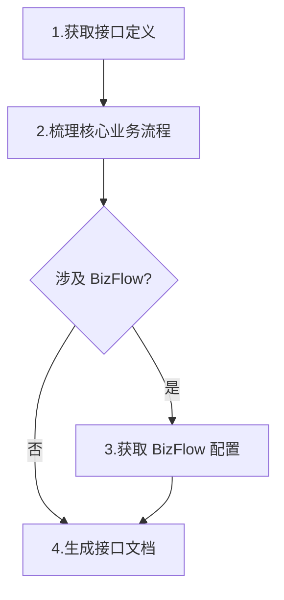
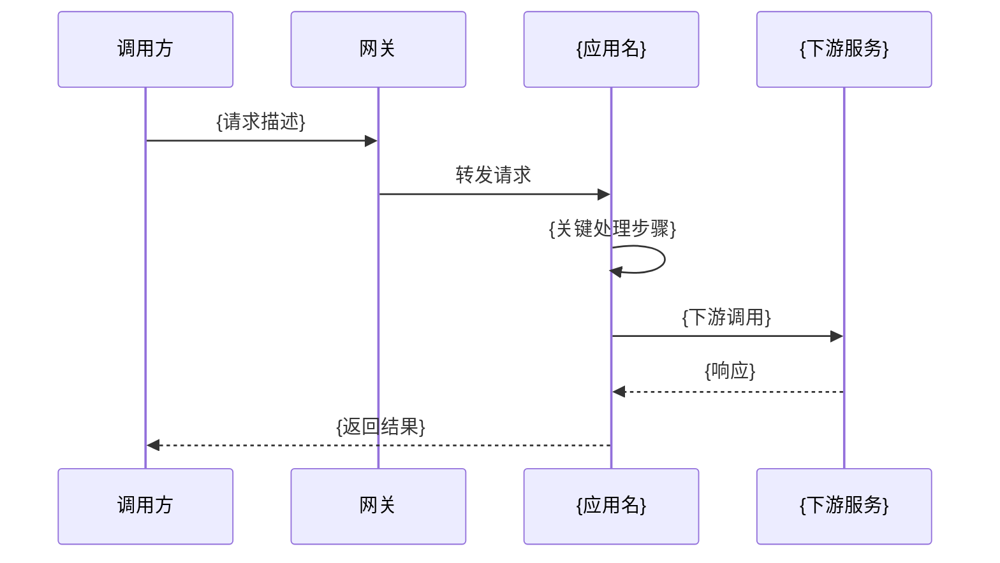

# Skill: 接口文档生成

## 触发方式

使用 `/api-doc-gen` 或当用户要求"生成接口文档"、"写接口文档"、"整理接口文档"时触发。

/api-doc-gen
应用名: repayengine
项目路径:  ~/Documents/workspace_v2/repayengine
接口路径: /repay/apply_submit
输出目录: shuhe/workspace/repayengine/base/api

## 概述

根据接口信息自动生成**业务视角**的接口文档，包含：
- **概述**：背景、负责人、版本
- **核心业务流程**：时序图、业务规则、状态流转
- **接口定义**：请求/响应参数、示例、错误码
- **BizFlow 计划配置**（如涉及）：计划概览、画布流程、节点配置、入参映射

> **核心原则**：不包含代码实现细节。参数告诉调用方"怎么调"，业务流程告诉所有人"为什么这么设计"和"出了问题怎么排查"，BizFlow 配置告诉运维和开发"流程怎么编排"。

---

## 前置输入

用户需提供以下信息：

| 参数 | 必填 | 说明 | 示例 |
|------|------|------|------|
| **应用名** | 是 | API Center 中的应用名 | `repayengine` |
| **接口路径或名称** | 是 | 接口 URL 或关键词 | `/api/v1/settlement/submit` |
| **bizKey** | 否 | BizFlow 计划编码（涉及业务流时提供） | `PF-tradebiz-xxx` |
| **输出目录** | 否 | 文档输出目录（默认当前目录） | `shuhe/workspace/repayengine/api` |

---

## 执行流程



### Step 1: 获取接口定义

**MCP 工具**: `sh_apicenter.get_api_list`

```
参数: { context: "<应用名>", url: "<接口路径>" }
或:   { context: "<应用名>", apiName: "<接口名称>" }
```

**提取字段**:
- 接口路径、请求方法、接口名称
- 请求参数定义（字段名、类型、必填、说明）
- 响应参数定义（字段名、类型、说明）
- 错误码列表

### Step 2: 梳理核心业务流程

根据接口语义和参数，梳理业务流程：
1. **业务时序图**：调用方 → 网关 → 本系统 → 下游服务之间的交互
2. **业务规则**：从接口参数和错误码推导关键校验规则
3. **状态流转**：如接口涉及状态变更，绘制状态机

### Step 3: 获取 BizFlow 配置（如涉及）

**MCP 工具**: `sh_biz_plan.plan_base_query` → `sh_biz_plan.plan_version_list` → `sh_biz_plan.plan_detail_query`

```
# 查询计划基本信息
plan_base_query: { bizKey: "<bizKey>" }

# 获取最新版本详情
plan_version_list: { bizKey: "<bizKey>" }
plan_detail_query: { id: <versionId> }
```

**提取字段**:
- 计划名称、bizKey、触发方式、运行模式
- 画布节点与连线（flowVersionContext）
- 节点配置（类型、动作编码、渠道）
- 入参映射（属性池配置）

### Step 4: 按模板生成文档

按照文档模板生成，输出到: `{输出目录}/{接口名称}.md`

---

## 文档模板

```markdown
# {接口名称}

## 1. 概述

| 属性 | 值 |
|------|-----|
| **接口名称** | {apiName} |
| **接口路径** | `{method} {url}` |
| **所属应用** | {context} |
| **负责人** | {owner} |
| **版本** | {version} |
| **更新日期** | {updateDate} |
| **关联需求** | {jiraId}（如有） |
| **接口状态** | {apiStatus} |

---

## 2. 核心业务流程

### 2.1 业务背景

{用1-2段话描述该接口要解决的业务问题和使用场景}

### 2.2 业务时序图



### 2.3 业务规则

| 规则编号 | 规则描述 | 处理方式 |
|---------|---------|---------|
| R1 | {规则1} | {处理方式} |
| R2 | {规则2} | {处理方式} |

### 2.4 状态流转

> 仅当接口涉及状态变更时需要此章节

```mermaid
stateDiagram-v2
    [*] --> {初始状态}: {触发动作}
    {初始状态} --> {中间状态}: {条件}
    {中间状态} --> {终态}: {条件}
```

---

## 3. 接口定义

### 3.1 请求参数

| 参数名 | 类型 | 必填 | 说明 |
|--------|------|------|------|
| {paramName} | {type} | {required} | {description} |

### 3.2 请求示例

```json
{
  "field1": "value1",
  "field2": 123
}
```

### 3.3 响应参数

| 参数名 | 类型 | 说明 |
|--------|------|------|
| code | int | 状态码，0=成功 |
| message | String | 提示信息 |
| data.{field} | {type} | {description} |

### 3.4 响应示例

```json
{
  "code": 0,
  "message": "success",
  "data": {}
}
```

### 3.5 错误码

| 错误码 | 说明 | 处理建议 |
|--------|------|---------|
| {code} | {description} | {suggestion} |

---

## 4. BizFlow 计划配置

> 仅当接口涉及 BizFlow 编排时需要此章节，否则删除

### 4.1 计划概览

| 属性 | 值 |
|------|-----|
| **计划名称** | {planName} |
| **bizKey** | {bizKey} |
| **平台** | {platformCode} |
| **业务场景** | {sceneCode} |
| **触发方式** | {triggerType} |
| **运行模式** | {runModelEnum} |
| **负责人** | {principalUid} |
| **状态** | {planStatus} |

### 4.2 画布流程

```mermaid
flowchart LR
    START([触发入口]) --> A[{节点1名称}]
    A --> B{判断节点}
    B -->|条件1| C[{节点2名称}]
    B -->|条件2| D[{节点3名称}]
    C --> END([结束])
```

### 4.3 节点配置

| 节点名称 | 节点类型 | 动作编码 | 渠道 | 说明 |
|---------|---------|---------|------|------|
| {nodeName} | {nodeType} | {templateCode} | {channel} | {description} |

### 4.4 入参映射

| 属性池Key | 来源 | 表达式 | 说明 |
|----------|------|--------|------|
| {propertyPoolKey} | {propertySource} | {paramExpression} | {description} |

### 4.5 关联子流程

| 子流程名称 | bizKey | 说明 |
|-----------|--------|------|
| {subflowName} | {subflowBizKey} | {description} |

### 4.6 配置注意事项

| 项目 | 说明 |
|------|------|
| 幂等控制 | {幂等策略} |
| 超时配置 | {超时时间} |
| 重试策略 | {重试次数、间隔} |
| 控频 | {频率限制} |

---

## 标签
#{应用名} #{业务域} #接口文档
```

---

## MCP 工具参考

| 工具 | 用途 | 关键参数 |
|------|------|----------|
| `sh_apicenter.get_api_list` | 查询接口定义 | context, url/apiName |
| `sh_biz_plan.plan_base_query` | 查询 BizFlow 基础信息 | bizKey |
| `sh_biz_plan.plan_version_list` | 获取版本列表 | bizKey |
| `sh_biz_plan.plan_detail_query` | 获取版本详情（含画布） | id |

---

## 编写规范

### 文档原则

1. **业务视角优先**：描述"做了什么"和"为什么"，不描述代码实现
2. **无代码片段**：不贴源码，关键逻辑用 mermaid 图或文字说明
3. **流程可视化**：使用 mermaid 时序图、流程图、状态图
4. **BizFlow 按需**：仅当接口涉及 BizFlow 编排时才包含第 4 部分

### 各部分核心价值

| 文档部分 | 回答什么问题 | 受众 |
|---------|------------|------|
| **概述** | 这是什么？谁负责？ | 所有人 |
| **核心业务流程** | 业务上怎么运转？有什么规则？ | 产品、测试、开发 |
| **接口定义** | 怎么调？传什么参数？ | 前端、调用方 |
| **BizFlow 配置** | 流程怎么编排？节点怎么配？ | 开发、运维 |

### Mermaid 图表规范

- **时序图**：用于系统间交互（调用方 → 服务 → 下游）
- **流程图**：用于 BizFlow 画布流程
- **状态图**：用于有状态流转的业务

### Wiki 链接

- 引用其他文档使用 `[[文档名]]` 格式
- BizFlow 子流程引用对应的 bizflow 文档

---

## 标签
#skill #接口文档 #api-doc #bizflow
