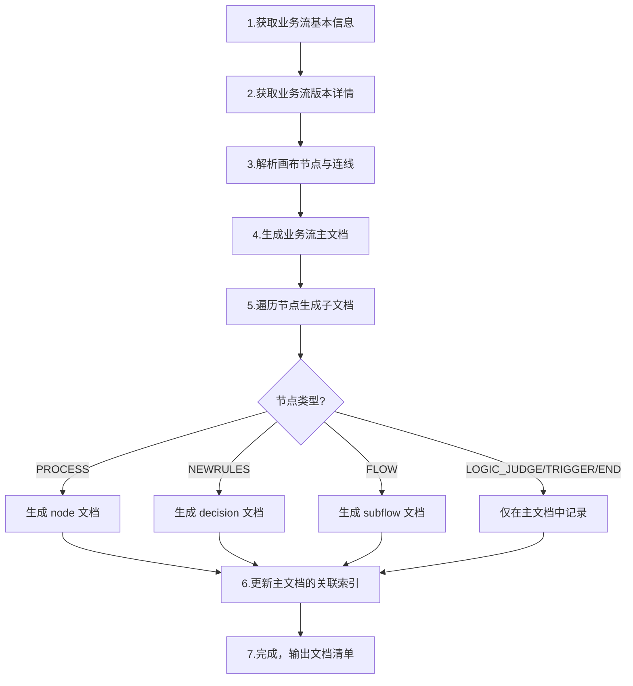

# Skill: Bizflow 业务流文档生成

## 触发方式

使用 `/bizflow-doc-gen` 或当用户要求"整理业务流文档"、"生成bizflow文档"、"初始化bizflow"时触发。

/bizflow-doc-gen  
bizkey: PF-tradebiz-sold_repay_apply_v1  
生成文档目录：shuhe/workspace/repayengine/base/bizflow

## 概述

根据业务流 bizKey 自动生成完整的业务流文档体系，包括：
- **业务流主文档**：流程概览、节点清单、流程图、异常策略
- **节点文档**（node）：每个 PROCESS 处理器的详细逻辑分析
- **决策文档**（decision）：NEWRULES 决策节点的规则说明
- **子流程文档**（subflow）：FLOW 类型子流程的独立文档

---

## 前置输入

用户需提供以下信息：

| 参数 | 必填 | 说明 | 示例 |
|------|------|------|------|
| **bizKey** | 是 | 业务流的 bizKey | `PF-tradebiz-repayapply_orderpay_vh401` |
| **输出目录** | 否 | 文档输出根目录（默认当前目录） | `shuhe/workspace/repayengine/base/bizflow` |
| **代码仓库路径** | 否 | 代码仓库本地路径，用于节点逻辑分析 | `/Users/xxx/repo/repayengine` |
| **platformCode** | 否 | 平台代码，部分接口需要 | `tradebiz` |

---

## 执行流程



### Step 1: 获取业务流基本信息

**MCP 工具**: `sh_biz_plan.plan_base_query`

```
参数: { bizKey: "<用户提供的bizKey>" }
```

**提取字段**:
- planName（业务流名称）
- bizKey（业务流KEY）
- planStatus（状态）
- platformCode（平台代码）
- sceneCode（场景代码）
- principalUid（负责人）
- createdBy / updatedBy
- description（描述）
- runModelEnum（运行模式: STATEFUL/STATELESS）

### Step 2: 获取业务流版本详情

**MCP 工具**: `sh_biz_plan.plan_version_list` → `sh_biz_plan.plan_detail_query`

```
# 先获取版本列表
plan_version_list: { bizKey: "<bizKey>" }

# 取最新版本的 id，获取详情
plan_detail_query: { id: <versionId> }
```

**提取字段**:
- flowVersionContext（画布JSON，包含所有节点和连线定义）
- version（版本号）
- triggerType（触发类型）
- onlineAt / offlineAt（生效时间）
- 流程变量（planPropertyPoolRespList 中 collectFlag=true 的项）

### Step 3: 解析画布节点与连线

从 `flowVersionContext` 中解析：

**节点分类**:

| 节点类型 | 类型标识 | 文档归属 | 说明 |
|----------|----------|----------|------|
| 触发节点 | TRIGGER_METHOD | 主文档 | 流程入口 |
| 处理器节点 | PROCESS | node 子文档 | 业务逻辑处理 |
| 决策节点 | NEWRULES | decision 子文档 | 规则引擎决策 |
| 逻辑判断 | LOGIC_JUDGE | 主文档 | 排他网关/条件分支 |
| 子流程节点 | FLOW | subflow 子文档 | 嵌入的子流程 |
| 结束节点 | END | 主文档 | 流程结束 |

**连线解析**:
- 根据连线(edges)的 source/target 还原节点执行顺序
- 识别循环结构（连线回指上游节点）
- 识别分支结构（LOGIC_JUDGE 的多条出边 + 条件表达式）

### Step 4: 生成业务流主文档

按照模板生成，输出到: `{输出目录}/{业务流名称}.md`

### Step 5: 遍历节点生成子文档

对每个 PROCESS / NEWRULES / FLOW 节点：
1. 确定输出目录（node/ decision/ subflow/）
2. 如有代码仓库路径，查找对应实现类并分析逻辑
3. 按对应模板生成文档

### Step 6: 更新关联索引

在主文档末尾生成完整的节点关联索引，确保所有 wikilink 指向正确。

---

## MCP 工具参考

### sh_biz_plan（业务流服务）

| 工具 | 用途 | 关键参数 |
|------|------|----------|
| `plan_base_query` | 查询业务流基础信息 | bizKey |
| `plan_base_list` | 搜索业务流列表 | nameOrKey, platformCode |
| `plan_version_list` | 获取版本列表 | bizKey |
| `plan_detail_query` | 获取版本详情（含画布） | id (版本ID) |
| `plan_detail_query_by_bizkey` | 按bizKey+版本获取详情 | bizKey, version |

### sh_configservice（配置服务）

| 工具 | 用途 | 关键参数 |
|------|------|----------|
| `query_simbusiness_config` | 查询业务配置 | context(应用名), env, searchName |

**使用场景**: 节点逻辑中引用了 confplus 配置时，通过此工具获取配置值和说明。

---

## 文档模板

### 模板 A: 业务流主文档

```markdown
# {业务流名称}

## 基本信息

| 属性         | 值                                      |
| ---------- | -------------------------------------- |
| **业务流名称**  | {planName}                             |
| **业务流KEY** | {bizKey}                               |
| **版本号**    | {version}                              |
| **平台代码**   | {platformCode}                         |
| **场景代码**   | {sceneCode}                            |
| **计划代码**   | {planCode}                             |
| **状态**     | {planStatus}                           |
| **运行模式**   | {runModelEnum} ({运行模式中文})              |
| **触发类型**   | {triggerType} ({触发类型中文})               |
| **负责人UID** | {principalUid}                         |
| **创建人**    | {createdBy}                            |
| **更新人**    | {updatedBy}                            |
| **描述**     | {description}                          |
| **生效时间**   | {onlineAt} 至 {offlineAt}               |

## 业务流程概述

{用1-2段话描述业务流的整体目标和定位}

### 核心功能
1. **{阶段1名称}**：{阶段1说明}
2. **{阶段2名称}**：{阶段2说明}
...

## 流程变量

| 变量名 | 变量代码 | 类型 | 来源 | 说明 |
|--------|----------|------|------|------|
| {变量名} | {变量代码} | {类型} | {来源} | {说明} |

## 流程节点详情

### 1. {阶段名称}

#### {nodeKey} - {节点名称}
- **节点类型**: {节点类型}
- **处理器**: {handlerCode}
- **功能**: {功能描述}
- **关联**: [[{handlerCode}]]

> 对于 LOGIC_JUDGE 节点，需要列出判断条件和各分支：
> - 分支1: `{条件表达式}` ({分支说明})
> - 分支2: 默认分支 ({说明})

> 对于 NEWRULES 决策节点：
> - **决策引擎**: {engineType}
> - **规则KEY**: {ruleKey}
> - **规则名称**: {ruleName}
> - **当前版本**: {ruleVersion}
> - **关联**: [[{ruleKey}]]

> 对于 FLOW 子流程节点：
> - **子流程KEY**: {subflowBizKey}
> - **计划代码**: {subflowPlanCode}
> - **说明**: {说明}
> - **关联**: [[{子流程名称}]]

## 流程图（简化版）

```
{用缩进文本表示流程走向}
{标注循环结构和分支结构}
{每个节点格式: 节点名称(处理器代码)}
```

## 异常处理策略

### 全局异常策略
- **处理方式**: {全局异常策略}
- **重试次数**: {retryTimes}（如有）
- **重试间隔**: {retryInterval}（如有）
- **失败后状态**: {failedStatus}（如有）

### 节点级异常策略
| 节点 | 处理器 | 异常策略 |
|------|--------|----------|
| {节点名称} | {处理器} | {策略描述} |

## 子流程关联

| 子流程名称 | 子流程KEY | 说明 |
|-----------|----------|------|
| [[{子流程名称}]] | {子流程KEY} | {说明} |

## 节点关联索引

### 处理器节点
- [[{处理器代码}]] - {节点名称}

### 决策节点
- [[{规则KEY}]] - {规则名称}

## 相关文档
- [[{关联文档1}]]
- [[{关联文档2}]]

## 标签
#业务流 #{业务域} #{平台} #{关键特征}
```

---

### 模板 B: 节点文档（node）

**文件路径**: `{输出目录}/node/{处理器代码}.md`

```markdown
# {处理器代码} - {节点名称}

## 节点信息

| 属性 | 值 |
|------|-----|
| **处理器代码** | {handlerCode} |
| **节点名称** | {nodeName} |
| **节点类型** | PROCESS |
| **所属流程** | [[{所属业务流名称}]] |
| **执行阶段** | {所属阶段名称} |
| **实现类** | {实现类全名} |

## 功能说明

{用1-2句话描述节点的核心功能}

### 核心职责
1. **{职责1}**: {详细说明}
2. **{职责2}**: {详细说明}
3. **{职责3}**: {详细说明}

## 处理流程

```mermaid
flowchart TD
    A[开始] --> B[{步骤1}]
    B --> C[{步骤2}]
    C --> D{判断条件}
    D -->|条件1| E[{处理1}]
    D -->|条件2| F[{处理2}]
    E --> G[返回SUCCESS]
    F --> H[抛出异常]
```

## 核心业务逻辑

### 1. {逻辑块1名称}
- {具体逻辑描述}
- {校验规则/计算公式/调用说明}

### 2. {逻辑块2名称}
- {具体逻辑描述}

## 异常处理

| 异常场景 | 处理方式 |
|----------|----------|
| {场景描述} | {处理方式: 抛出异常/忽略/重试} |

## 实现位置

```bash
{模块名}/src/main/java/{包路径}/
└── {实现类名}.java
```

## 相关文档
- [[{所属业务流}]] - 所属业务流
- [[{上游节点}]] - 上游节点
- [[{下游节点}]] - 下游节点

## 标签
#节点 #{功能标签} #{处理器代码}
```

**节点文档编写要点**:
- 要参考实际代码，进行业务逻辑分析
- 文档中**不需要粘贴代码片段**，关键流程总结成 mermaid 流程图或文字
- 重点描述"做了什么"和"为什么"，而非"怎么写的"
- 对于复杂节点（如 PH170005V1），可增加以下章节：
  - 输入参数 / 输出参数
  - 状态流转（mermaid stateDiagram）
  - 设计考虑（FAQ式的为什么）
  - 性能优化 / 监控指标

---

### 模板 C: 决策文档（decision）

**文件路径**: `{输出目录}/decision/{规则KEY}.md`

```markdown
# {规则KEY} - {规则名称}

## 决策信息

| 属性 | 值 |
|------|------|
| **规则KEY** | {ruleKey} |
| **规则名称** | {ruleName} |
| **节点类型** | NEWRULES (决策节点) |
| **决策引擎** | {engineType} |
| **所属流程** | [[{所属业务流名称}]] |
| **当前执行版本** | {currentVersion} |
| **版本策略** | {versionStrategy} |
| **异常策略** | {errorStrategy} |

## 功能说明

{描述决策节点的业务目标和决策逻辑}

### 决策目标
1. **{目标1}**: {说明}
2. **{目标2}**: {说明}

## 决策版本

### 版本 {N}（当前执行版本）
- **版本描述**: {description}
- **版本ID**: {versionId}
- **状态**: {status}
- **创建人**: {creator}
- **更新人**: {updater}

## 输入参数

由 [[{入参组装节点}]] 节点组装：

| 参数名 | 参数代码 | 类型 | 说明 |
|--------|----------|------|------|
| {参数名} | {参数代码} | {类型} | {说明} |

## 输出参数

由 [[{出参解析节点}]] 节点解析：

| 参数名 | 参数代码 | 类型 | 说明 |
|--------|----------|------|------|
| {参数名} | {参数代码} | {类型} | {说明} |

## 决策流程

```
{用文本描述决策逻辑流转}
```

## 关联节点

| 节点 | 处理器 | 关系 | 说明 |
|------|--------|------|------|
| {节点名} | [[{处理器}]] | {上游/下游/循环控制} | {说明} |

## 相关文档
- [[{所属业务流}]] - 所属业务流
- [[{入参节点}]] - 入参组装
- [[{出参节点}]] - 出参解析

## 标签
#决策节点 #{功能标签} #{规则KEY}
```

---

### 模板 D: 子流程文档（subflow）

**文件路径**: `{输出目录}/subflow/{子流程名称}.md`

子流程文档结构与业务流主文档（模板A）**基本一致**，差异点：

| 差异项 | 业务流主文档 | 子流程文档 |
|--------|-------------|------------|
| 触发类型 | SYSTEM_TRIGGER | PARENT_CALL（父流程调用） |
| 增加字段 | - | 调用位置、触发条件 |
| 增加章节 | - | 调用关系（上游调用方 + 被调用方 + 数据流转） |
| 增加章节 | - | 输入参数 / 输出参数 |

**子流程基本信息表额外字段**:
```markdown
| **触发类型**   | PARENT_CALL (父流程调用)                  |
| **调用位置**   | [[{父流程1}]]、[[{父流程2}]]              |
| **触发条件**   | `{条件表达式}`                            |
```

---

## 目录结构

```
{输出目录}/
├── {业务流名称}.md                    # 业务流主文档
├── node/
│   ├── {PH处理器代码1}.md             # 节点文档
│   ├── {PH处理器代码2}.md
│   └── ...
├── decision/
│   ├── {JC规则KEY1}.md               # 决策文档
│   └── ...
└── subflow/
    ├── {子流程名称1}.md               # 子流程文档
    └── ...
```

---

## 编写规范

### 通用规范

1. **Wiki 链接**：所有节点/流程/文档引用使用 `[[名称]]` 格式
2. **标签约定**：
   - 业务流: `#业务流 #{业务域} #{平台代码}`
   - 节点: `#节点 #{功能标签} #{处理器代码}`
   - 决策: `#决策节点 #{功能标签} #{规则KEY}`
   - 子流程: `#子流程 #{功能标签}`
3. **流程图**：主文档用文本缩进流程图，节点文档用 mermaid 流程图
4. **不贴代码**：文档中不粘贴代码片段，用 mermaid 或文字总结关键逻辑

### 节点文档深度分级

| 级别 | 适用场景 | 包含章节 |
|------|----------|----------|
| **简洁版** | 逻辑简单的节点（<50行代码） | 节点信息 + 功能说明 + 处理流程 + 异常处理 |
| **标准版** | 一般复杂度节点 | 简洁版 + 核心业务逻辑 + 实现位置 + 相关文档 |
| **详细版** | 核心/复杂节点（如子流程分发、核心计算） | 标准版 + 输入输出参数 + 状态流转 + 设计考虑 + 性能优化 + 监控指标 |

### 枚举值中文映射

| 字段 | 枚举值 | 中文 |
|------|--------|------|
| runModelEnum | STATEFUL | 有状态 |
| runModelEnum | STATELESS | 无状态 |
| triggerType | SYSTEM_TRIGGER | 系统触发 |
| triggerType | PARENT_CALL | 父流程调用 |
| planStatus | ONLINE | 已上线 |
| planStatus | OFFLINE | 已下线 |
| planStatus | DESIGN | 设计中 |

---

## 工作流示例

以下是完整的执行示例：

### 用户输入
```
整理bizflow业务流：PF-tradebiz-repayapply_orderpay_vh401
业务流目录：shuhe/workspace/repayengine/base/bizflow
节点目录：shuhe/workspace/repayengine/base/bizflow/node
决策目录：shuhe/workspace/repayengine/base/bizflow/decision
子流程目录：shuhe/workspace/repayengine/base/bizflow/subflow
```

### 执行步骤

1. **调用 MCP 获取基本信息**
   ```
   sh_biz_plan.plan_base_query({ bizKey: "PF-tradebiz-repayapply_orderpay_vh401" })
   ```

2. **获取版本详情**
   ```
   sh_biz_plan.plan_version_list({ bizKey: "PF-tradebiz-repayapply_orderpay_vh401" })
   → 取最新版本 id
   sh_biz_plan.plan_detail_query({ id: <versionId> })
   ```

3. **解析画布 JSON**
   - 从 flowVersionContext 中提取所有节点（nodes）和连线（edges）
   - 按连线顺序排列节点
   - 识别循环和分支结构
   - 按业务阶段分组

4. **生成主文档** → `{目录}/重资产分期制还款同步流程V401.md`

5. **逐个生成子文档**
   - PROCESS 节点 → `node/PH110001.md`, `node/PH110010.md`, ...
   - NEWRULES 节点 → `decision/JC-202405140001.md`, ...
   - FLOW 节点 → `subflow/扣款失败话术策略子流程.md`

6. **（可选）代码分析**
   - 如提供了代码仓库路径，查找 `*{handlerCode}*ServiceImpl.java`
   - 分析核心方法的业务逻辑，总结为 mermaid 流程图

7. **输出文档清单**

---

## 参考文档

以下文档是本 Skill 模板的参考样本：

| 文档类型 | 参考文件 | 说明 |
|----------|----------|------|
| 业务流主文档（同步/无状态） | [[重资产分期制还款同步流程V401]] | 包含循环和分支结构 |
| 业务流主文档（异步/有状态） | [[重资产分期制还款异步子流程V401]] | 包含多阶段处理 |
| 简洁版节点文档 | [[PH110001]] | 准入校验，逻辑简单 |
| 详细版节点文档 | [[PH170005V1]] | 异步子流程分发，逻辑复杂 |
| 决策文档 | [[JC-202405140001]] | 含循环机制说明 |
| 子流程文档 | [[扣款失败话术策略子流程]] | 含调用关系和降级方案 |

## 标签
#skill #bizflow #文档生成 #业务流 #repayengine
